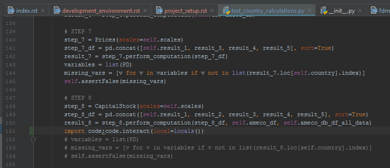

.. _project_setup:

Project Setup
=============

1. Clone the repository

.. code-block:: console

    $ git clone https://github.com/ECFIN-FDMS/FDMS.git
    $ cd FDMS

2. Install requirements
    If you have virtualenvwrapper installed you can create a virtualenv for the project

.. code-block:: console

    $ # mkvirtualenv fdms
    $ pip install -r requirements-dev.txt

2. run the tests

.. code-block:: console

    $ pytest --cov fdms -s

.. _data_structures:

Overview of dataframe structures used
=====================================

We are using two different dataframe structures in most of the calculations.
Both have the same columns: years from 1993 to 2020 (his will need to be updated every year) and four extra columns for metadata:

- Country Ameco
- Variable Code
- Frequency
- Scale

>>> COLUMN_ORDER = ['Country Ameco', 'Variable Code', 'Frequency', 'Scale', 1993, 1994,
                     1995, 1996, 1997, 1998, 1999, 2000, 2001, 2002, 2003, 2004, 2005,
                     2006, 2007, 2008, 2009, 2010, 2011, 2012, 2013, 2014, 2015, 2016,
                     2017, 2018, 2019]

The difference between these types of dataframes is that one has a MultiIndex ("Country Ameco", "Variable Code") and the other one the default RangeIndex.

When reading input data from excel, the helper functions set a MultiIndex in the dataframe.

When writing the calculated series to the result dataframe, the result dataframe doesn't have the MultiIndex, we set it at the end of each step, just before returning the result.

In some specific cases we need data until 1960, these steps need bigger dataframes.

The StepMixin provides the methods :meth:`get_meta` and :meth:`get_data`. :meth:`get_meta` takes a variable and returns the metadata, and :meth:`get_data` takes a dataframe and a variable and returns the numeric values for that variable, ready to perform mathematical operations on them.

>>> from fdms.utils.interfaces import read_ameco_txt, read_country_forecast_excel, read_ameco_db_xls
>>> ameco_h=read_ameco_txt()
>>> ameco_h.columns
Index([              'CODE',  'Country/Aggregate', 'Unit of the series',
                    'Title',    'Unit indication',                 1993,
                       1994,                 1995,                 1996,
                       1997,                 1998,                 1999,
                       2000,                 2001,                 2002,
                       2003,                 2004,                 2005,
                       2006,                 2007,                 2008,
                       2009,                 2010,                 2011,
                       2012,                 2013,                 2014,
                       2015,                 2016,                 2017],
      dtype='object')
>>> ameco_h.index
MultiIndex(levels=[['AT', 'BE', 'BG', 'CY', 'CZ', 'DE', 'DK', 'EA17', 'EA18', 'EA19', 'EE', 'EL', 'ES', 'EU27', 'EU28', 'FI', 'FR', 'HR', 'HU', 'IE', 'IT', 'JP', 'LT', 'LU', 'LV', 'MT', 'NL', 'PL', 'PT', 'RO', 'SE', 'SI', 'SK', 'UK', 'US'], ['ASGH.1.0.0.0', 'AVGDGP.1.0.0.0', 'CVGD0.1.0.0.0', 'CVGD1.1.0.0.0', 'CVGD10.1.0.0.0', 'CVGD2.1.0.0.0', 'CVGD3.1.0.0.0', 'CVGD4.1.0.0.0', 'CVGD5.1.0.0.0', 'CVGD6.1.0.0.0', 'CVGD6A.1.0.0.0', 'CVGD7.1.0.0.0', 'CVGD7A.1.0.0.0', 'CVGD8.1.0.0.0', 'CVGD8A.1.0.0.0', 'CVGD9.1.0.0.0', 'DMGE.1.0.0.0', 'DMGI.1.0.0.0', 'DXGE.1.0.0.0', 'DXGI.1.0.0.0', 'FETD.1.0.0.0', 'FETD9.1.0.0.0', 'FWTD.1.0.0.0', 'KNP.1.0.212.0', 'NECN.1.0.0.0', 'NETD.1.0.0.0', 'NETN.1.0.0.0', 'NLHA.1.0.0.0', 'NLHT.1.0.0.0', 'NLHT9.1.0.0.0', 'NLTN.1.0.0.0', 'NPAN.1.0.0.0', 'NPAN1.1.0.0.0', 'NPTD.1.0.0.0', 'NUTN.1.0.0.0', 'NWTD.1.0.0.0', 'OCCG.1.0.0.0', 'OCIG.1.0.0.0', 'OCPH.1.1.0.0', 'OCTG.1.1.0.0', 'OIGCO.1.1.0.0', 'OIGDW.1.1.0.0', 'OIGEQ.1.1.0.0', 'OIGOT.1.1.0.0', 'OIGT.1.1.0.0', 'OIST.1.0.0.0', 'OITT.1.1.0.0', 'OKCT.1.0.0.0', 'OKND.1.0.0.0', 'OMGN.1.1.0.0', 'OMGS.1.1.0.0', 'OMSN.1.1.0.0', 'OUNT.1.1.0.0', 'OUTT.1.1.0.0', 'OVGD.1.1.0.0', 'OVGDP.1.0.0.0', 'OVGE.1.0.0.0', 'OXGN.1.1.0.0', 'OXGS.1.1.0.0', 'OXSN.1.1.0.0', 'PLCD.3.1.0.0', 'PLCDQ.3.0.0.437', 'RVGDP.1.1.0.0', 'UBCA.1.0.0.0', 'UBCABOP.1.0.0.0', 'UBKA.1.0.0.0', 'UBLA.1.0.0.0', 'UBLGAP.1.0.319.0', 'UBLGAPS.1.0.319.0', 'UBLGBP.1.0.319.0', 'UBLGE.1.0.0.0', 'UBRA.1.0.0.0', 'UBTA.1.0.0.0', 'UCCG0.1.0.0.0', 'UCIG0.1.0.0.0', 'UCPH.1.0.0.0', 'UCPH.1.1.0.0', 'UCPH0.1.0.0.0', 'UCTG.1.0.0.0', 'UCTGI.1.0.0.0', 'UCTPH.1.0.0.0', 'UCTRC.1.0.0.0', 'UCTRH.1.0.0.0', 'UDGGL.1.0.0.0', 'UDMGCE.1.0.0.0', 'UDMGCR.1.0.0.0', 'UDMGKE.1.0.0.0', 'UDMGKTR.1.0.0.0', 'UEHC.1.0.0.0', 'UEHH.1.0.0.0', 'UGVAC.1.0.0.0', 'UIGCO.1.0.0.0', 'UIGDW.1.0.0.0', 'UIGEQ.1.0.0.0', 'UIGG0.1.0.0.0', 'UIGOT.1.0.0.0', 'UIGT.1.0.0.0', 'UIST.1.0.0.0', 'UITC.1.0.0.0', 'UITH.1.0.0.0', 'UKCG0.1.0.0.0', 'UKCT.1.0.0.0', 'UKOC.1.0.0.0', 'UKOG.1.0.0.0', 'UKOH.1.0.0.0', 'UKTG995.1.0.0.0', 'UKTTG.1.0.0.0', 'UMGN.1.0.0.0', 'UMGN.1.1.0.0', 'UMSN.1.0.0.0', 'UMSN.1.1.0.0', 'UOGC.1.0.0.0', 'UOGH.1.0.0.0', 'UOOMSE.1.0.0.0', 'UOOMSR.1.0.0.0', 'UPOMN.1.0.0.0', 'UROG.1.0.0.0', 'URTG.1.0.0.0', 'USGG.1.0.0.0', 'USGH.1.0.0.0', 'USGN.1.0.0.0', 'USGP.1.0.0.0', 'UTAG.1.0.0.0', 'UTKG.1.0.0.0', 'UTSG.1.0.0.0', 'UTVC.1.0.0.0', 'UTVG.1.0.0.0', 'UTVTBP.1.0.0.0', 'UTYC.1.0.0.0', 'UTYG.1.0.0.0', 'UTYH.1.0.0.0', 'UUOG.1.0.0.0', 'UUTG.1.0.0.0', 'UUTGE.1.0.0.0', 'UVGD.1.0.0.0', 'UVGD.1.1.0.0', 'UVGDH.1.0.0.0', 'UVGE.1.0.0.0', 'UVGH.1.0.0.0', 'UWCC.1.0.0.0', 'UWCD.1.0.0.0', 'UWCD.1.1.0.0', 'UWCG.1.0.0.0', 'UWCH.1.0.0.0', 'UWSH.1.0.0.0', 'UWWD.1.0.0.0', 'UXGN.1.0.0.0', 'UXGN.1.1.0.0', 'UXSN.1.0.0.0', 'UXSN.1.1.0.0', 'UYIG.1.0.0.0', 'UYIGE.1.0.0.0', 'UYNC.1.0.0.0', 'UYNH.1.0.0.0', 'UYTGH.1.0.0.0', 'UYTGM.1.0.0.0', 'UYVC.1.0.0.0', 'UYVG.1.0.0.0', 'UYVT.1.0.0.0', 'UYVTBP.1.0.0.0', 'XNE.1.0.99.0', 'XNEE.1.0.99.0', 'XUNNQ.3.0.30.437', 'XUNRQ.3.0.30.437', 'ZCPIENG.1.0.0.0', 'ZCPIFOO.1.0.0.0', 'ZCPIH.1.0.0.0', 'ZCPINEG.1.0.0.0', 'ZCPISER.1.0.0.0', 'ZCPIUNF.1.0.0.0', 'ZCPIXEF.1.0.0.0', 'ZUTN.1.0.0.0']],
           labels=[[14, 13, 7, 8, 9, 1, 2, 4, 6, 5, 10, 19, 11, 12, 16, 17, 20, 3, 24, 22, 23, 18, 25, 26, 0, 27, 28, 29, 31, 32, 15, 30, 33, 34, 21, 14, 13, 7, 8, 9, 1, 2, 4, 6, 5, 10, 19, 11, 12, 16, 17, 20, 3, 24, 22, 23, 18, 25, 26, 0, 27, 28, 29, 31, 32, 15, 30, 33, 34, 21, 14, 13, 7, 8, 9, 1, 2, 4, 6, 5, 10, 19, 11, 12, 16, 17, 20, 3, 24, 22, 23, 18, 25, 26, 0, 27, 28, 29, 31, 32, 15, 30, 33, 34, 21, 14, 13, 7, 8, 9, 1, 2, 4, 6, 5, 10, 19, 11, 12, 16, 17, 20, 3, 24, 22, 23, 18, 25, 26, 0, 27, 28, 29, 31, 32, 15, 30, 33, 34, 21, 14, 13, 7, 8, 9, 1, 2, 4, 6, 5, 10, 19, 11, 12, 16, 17, 20, 3, 24, 22, 23, 18, 25, 26, 0, 27, 28, 29, 31, 32, 15, 30, 33, 34, 21, 14, 13, 7, 8, 9, 1, 2, 4, 6, 5, 10, 19, 11, 12, 16, 17, 20, 3, 24, 22, 23, 18, 25, 26, 0, 27, 28, 29, 31, 32, 15, 30, 33, 34, 21, 14, 13, 7, 8, 9, 1, 2, 4, 6, 5, 10, 19, 11, 12, 16, 17, 20, 3, 24, 22, 23, 18, 25, 26, 0, 27, 28, 29, 31, 32, 15, 30, 33, 34, 21, 14, 13, 7, 8, 9, 1, 2, 4, 6, 5, 10, 19, 11, 12, 16, 17, 20, 3, 24, 22, 23, 18, 25, 26, 0, 27, 28, 29, 31, 32, 15, 30, 33, 34, 21, 14, 13, 7, 8, 9, 1, 2, 4, 6, 5, 10, 19, 11, 12, 16, 17, 20, 3, 24, 22, 23, 18, 25, 26, 0, 27, 28, 29, 31, 32, 15, 30, 33, 34, 21, 14, 13, 7, 8, 9, 1, 2, 4, 6, 5, 10, 19, 11, 12, 16, 17, 20, 3, 24, 22, 23, 18, 25, 26, 0, 27, 28, 29, 31, 32, 15, 30, 33, 34, 21, 14, 13, 7, 8, 9, 1, 2, 4, 6, 5, 10, 19, 11, 12, 16, 17, 20, 3, 24, 22, 23, 18, 25, 26, 0, 27, 28, 29, 31, 32, 15, 30, 33, 34, 21, 14, 13, 7, 8, 9, 1, 2, 4, 6, 5, 10, 19, 11, 12, 16, 17, 20, 3, 24, 22, 23, 18, 25, 26, 0, 27, 28, 29, 31, 32, 15, 30, 33, 34, 21, 14, 13, 7, 8, 9, 1, 2, 4, 6, 5, 10, 19, 11, 12, 16, 17, 20, 3, 24, 22, 23, 18, 25, 26, 0, 27, 28, 29, 31, 32, 15, 30, 33, 34, 21, 14, 13, 7, 8, 9, 1, 2, 4, 6, 5, 10, 19, 11, 12, 16, 17, 20, 3, 24, 22, 23, 18, 25, 26, 0, 27, 28, 29, 31, 32, 15, 30, 33, 34, 21, 14, 13, 7, 8, 9, 1, 2, 4, 6, 5, 10, 19, 11, 12, 16, 17, 20, 3, 24, 22, 23, 18, 25, 26, 0, 27, 28, 29, 31, 32, 15, 30, 33, 34, 21, 14, 13, 7, 8, 9, 1, 2, 4, 6, 5, 10, 19, 11, 12, 16, 17, 20, 3, 24, 22, 23, 18, 25, 26, 0, 27, 28, 29, 31, 32, 15, 30, 33, 34, 21, 14, 13, 7, 8, 9, 1, 2, 4, 6, 5, 10, 19, 11, 12, 16, 17, 20, 3, 24, 22, 23, 18, 25, 26, 0, 27, 28, 29, 31, 32, 15, 30, 33, 34, 21, 14, 13, 7, 8, 9, 1, 2, 4, 6, 5, 10, 19, 11, 12, 16, 17, 20, 3, 24, 22, 23, 18, 25, 26, 0, 27, 28, 29, 31, 32, 15, 30, 33, 34, 21, 14, 13, 7, 8, 9, 1, 2, 4, 6, 5, 10, 19, 11, 12, 16, 17, 20, 3, 24, 22, 23, 18, 25, 26, 0, 27, 28, 29, 31, 32, 15, 30, 33, 34, 21, 14, 13, 7, 8, 9, 1, 2, 4, 6, 5, 10, 19, 11, 12, 16, 17, 20, 3, 24, 22, 23, 18, 25, 26, 0, 27, 28, 29, 31, 32, 15, 30, 33, 34, 21, 14, 13, 7, 8, 9, 1, 2, 4, 6, 5, 10, 19, 11, 12, 16, 17, 20, 3, 24, 22, 23, 18, 25, 26, 0, 27, 28, 29, 31, 32, 15, 30, 33, 34, 21, 14, 13, 7, 8, 9, 1, 2, 4, 6, 5, 10, 19, 11, 12, 16, 17, 20, 3, 24, 22, 23, 18, 25, 26, 0, 27, 28, 29, 31, 32, 15, 30, 33, 34, 21, 14, 13, 7, 8, 9, 1, 2, 4, 6, 5, 10, 19, 11, 12, 16, 17, 20, 3, 24, 22, 23, 18, 25, 26, 0, 27, 28, 29, 31, 32, 15, 30, 33, 34, 21, 14, 13, 7, 8, 9, 1, 2, 4, 6, 5, 10, 19, 11, 12, 16, 17, 20, 3, 24, 22, 23, 18, 25, 26, 0, 27, 28, 29, 31, 32, 15, 30, 33, 34, 21, 14, 13, 7, 8, 9, 1, 2, 4, 6, 5, 10, 19, 11, 12, 16, 17, 20, 3, 24, 22, 23, 18, 25, 26, 0, 27, 28, 29, 31, 32, 15, 30, 33, 34, 21, 14, 13, 7, 8, 9, 1, 2, 4, 6, 5, 10, 19, 11, 12, 16, 17, 20, 3, 24, 22, 23, 18, 25, 26, 0, 27, 28, 29, 31, 32, 15, 30, 33, 34, 21, 14, 13, 7, 8, 9, 1, 2, 4, 6, 5, 10, 19, 11, 12, 16, 17, 20, 3, 24, 22, 23, 18, 25, 26, 0, 27, 28, 29, 31, 32, 15, 30, 33, 34, 21, 14, 13, 7, 8, 9, 1, 2, 4, 6, 5, 10, 19, 11, 12, 16, 17, 20, 3, 24, 22, 23, 18, 25, 26, 0, 27, 28, 29, 31, 32, 15, 30, 33, 34, 21, 14, 13, 7, 8, 9, 1, 2, 4, 6, 5, 10, 19, 11, 12, 16, 17, 20, 3, 24, 22, 23, 18, 25, 26, 0, 27, 28, 29, 31, 32, 15, 30, 33, 34, 21, 14, 13, 7, 8, 9, 1, 2, 4, 6, 5, 10, 19, 11, 12, 16, 17, 20, 3, 24, 22, 23, 18, 25, 26, 0, 27, 28, 29, 31, 32, 15, 30, 33, 34, 21, 14, 13, 7, 8, 9, 1, 2, 4, 6, 5, 10, 19, 11, 12, 16, 17, 20, 3, 24, 22, 23, 18, 25, 26, 0, 27, 28, 29, 31, 32, 15, 30, 33, 34, 21, 14, 13, 7, 8, 9, 1, 2, 4, 6, 5, 10, 19, 11, 12, 16, 17, 20, 3, 24, 22, 23, 18, 25, 26, 0, 27, 28, 29, 31, 32, 15, 30, 33, 34, 21, 14, 13, 7, 8, 9, 1, 2, 4, 6, 5, 10, 19, 11, 12, 16, 17, 20, 3, 24, 22, 23, 18, 25, 26, 0, 27, 28, 29, 31, 32, 15, 30, 33, 34, 21, 14, 13, 7, 8, 9, 1, 2, 4, 6, 5, 10, 19, 11, 12, 16, 17, 20, 3, 24, 22, 23, 18, 25, 26, 0, 27, 28, 29, 31, 32, 15, 30, 33, 34, 21, 14, 13, 7, 8, 9, 1, 2, 4, 6, 5, 10, 19, 11, 12, 16, 17, 20, 3, 24, 22, 23, 18, 25, 26, 0, 27, 28, 29, 31, 32, 15, 30, 33, 34, 21, 14, 13, 7, 8, 9, 1, 2, 4, 6, 5, 10, 19, 11, 12, 16, 17, 20, 3, 24, 22, 23, 18, 25, 26, 0, 27, 28, 29, 31, 32, 15, 30, 33, 34, 21, 14, 13, 7, 8, 9, 1, 2, 4, 6, 5, 10, 19, 11, 12, 16, 17, 20, 3, 24, 22, 23, 18, 25, 26, 0, 27, 28, 29, 31, 32, 15, 30, 33, 34, 21, 14, 13, 7, 8, 9, 1, 2, 4, 6, 5, 10, 19, 11, 12, 16, 17, 20, 3, 24, 22, 23, 18, 25, 26, 0, 27, 28, 29, 31, 32, 15, 30, 33, 34, 21, 14, 13, 7, 8, 9, 1, 2, 4, 6, 5, 10, 19, 11, 12, 16, 17, 20, 3, 24, 22, 23, 18, 25, 26, 0, 27, 28, 29, 31, 32, 15, 30, 33, 34, 21, 14, 13, 7, 8, 9, 1, 2, 4, 6, 5, 10, 19, 11, 12, 16, 17, 20, 3, 24, 22, 23, 18, 25, 26, 0, 27, 28, 29, 31, 32, 15, 30, 33, 34, 21, 14, 13, 7, 8, 9, 1, 2, 4, 6, 5, 10, 19, 11, 12, 16, 17, 20, 3, 24, 22, 23, 18, 25, 26, 0, 27, 28, 29, 31, 32, 15, 30, 33, 34, 21, 14, 13, 7, 8, 9, 1, 2, 4, 6, 5, 10, 19, 11, 12, 16, 17, 20, 3, 24, 22, 23, 18, 25, 26, 0, 27, 28, 29, 31, 32, 15, 30, 33, 34, 21, 14, 13, 7, 8, 9, 1, 2, 4, 6, 5, 10, 19, 11, 12, 16, 17, 20, 3, 24, 22, 23, 18, 25, 26, 0, 27, 28, 29, 31, 32, 15, 30, 33, 34, 21, 14, 13, 7, 8, 9, 1, 2, 4, 6, 5, 10, 19, 11, 12, 16, 17, 20, 3, 24, 22, 23, 18, 25, 26, 0, 27, 28, 29, 31, 32, 15, 30, 33, 34, 21, 14, 13, 7, 8, 9, 1, 2, 4, 6, 5, 10, 19, 11, 12, 16, 17, 20, 3, 24, 22, 23, 18, 25, 26, 0, 27, 28, 29, 31, 32, 15, 30, 33, 34, 21, 14, 13, 7, 8, 9, 1, 2, 4, 6, 5, 10, 19, 11, 12, 16, 17, 20, 3, 24, 22, 23, 18, 25, 26, 0, 27, 28, 29, 31, 32, 15, 30, 33, 34, 21, 14, 13, 7, 8, 9, 1, 2, 4, 6, 5, 10, 19, 11, 12, 16, 17, 20, 3, 24, 22, 23, 18, 25, 26, 0, 27, 28, 29, 31, 32, 15, 30, 33, 34, 21, 14, 13, 7, 8, 9, 1, 2, 4, 6, 5, 10, 19, 11, 12, 16, 17, 20, 3, 24, 22, 23, 18, 25, 26, 0, 27, 28, 29, 31, 32, 15, 30, 33, 34, 21, 14, 13, 7, 8, 9, 1, 2, 4, 6, 5, 10, 19, 11, 12, 16, 17, 20, 3, 24, 22, 23, 18, 25, 26, 0, 27, 28, 29, 31, 32, 15, 30, 33, 34, 21, 14, 13, 7, 8, 9, 1, 2, 4, 6, 5, 10, 19, 11, 12, 16, 17, 20, 3, 24, 22, 23, 18, 25, 26, 0, 27, 28, 29, 31, 32, 15, 30, 33, 34, 21, 14, 13, 7, 8, 9, 1, 2, 4, 6, 5, 10, 19, 11, 12, 16, 17, 20, 3, 24, 22, 23, 18, 25, 26, 0, 27, 28, 29, 31, 32, 15, 30, 33, 34, 21, 14, 13, 7, 8, 9, 1, 2, 4, 6, 5, 10, 19, 11, 12, 16, 17, 20, 3, 24, 22, 23, 18, 25, 26, 0, 27, 28, 29, 31, 32, 15, 30, 33, 34, 21, 14, 13, 7, 8, 9, 1, 2, 4, 6, 5, 10, 19, 11, 12, 16, 17, 20, 3, 24, 22, 23, 18, 25, 26, 0, 27, 28, 29, 31, 32, 15, 30, 33, 34, 21, 14, 13, 7, 8, 9, 1, 2, 4, 6, 5, 10, 19, 11, 12, 16, 17, 20, 3, 24, 22, 23, 18, 25, 26, 0, 27, 28, 29, 31, 32, 15, 30, 33, 34, 21, 14, 13, 7, 8, 9, 1, 2, 4, 6, 5, 10, 19, 11, 12, 16, 17, 20, 3, 24, 22, 23, 18, 25, 26, 0, 27, 28, 29, 31, 32, 15, 30, 33, 34, 21, 14, 13, 7, 8, 9, 1, 2, 4, 6, 5, 10, 19, 11, 12, 16, 17, 20, 3, 24, 22, 23, 18, 25, 26, 0, 27, 28, 29, 31, 32, 15, 30, 33, 34, 21, 14, 13, 7, 8, 9, 1, 2, 4, 6, 5, 10, 19, 11, 12, 16, 17, 20, 3, 24, 22, 23, 18, 25, 26, 0, 27, 28, 29, 31, 32, 15, 30, 33, 34, 21, 14, 13, 7, 8, 9, 1, 2, 4, 6, 5, 10, 19, 11, 12, 16, 17, 20, 3, 24, 22, 23, 18, 25, 26, 0, 27, 28, 29, 31, 32, 15, 30, 33, 34, 21, 14, 13, 7, 8, 9, 1, 2, 4, 6, 5, 10, 19, 11, 12, 16, 17, 20, 3, 24, 22, 23, 18, 25, 26, 0, 27, 28, 29, 31, 32, 15, 30, 33, 34, 21, 14, 13, 7, 8, 9, 1, 2, 4, 6, 5, 10, 19, 11, 12, 16, 17, 20, 3, 24, 22, 23, 18, 25, 26, 0, 27, 28, 29, 31, 32, 15, 30, 33, 34, 21, 14, 13, 7, 8, 9, 1, 2, 4, 6, 5, 10, 19, 11, 12, 16, 17, 20, 3, 24, 22, 23, 18, 25, 26, 0, 27, 28, 29, 31, 32, 15, 30, 33, 34, 21, 14, 13, 7, 8, 9, 1, 2, 4, 6, 5, 10, 19, 11, 12, 16, 17, 20, 3, 24, 22, 23, 18, 25, 26, 0, 27, 28, 29, 31, 32, 15, 30, 33, 34, 21, 14, 13, 7, 8, 9, 1, 2, 4, 6, 5, 10, 19, 11, 12, 16, 17, 20, 3, 24, 22, 23, 18, 25, 26, 0, 27, 28, 29, 31, 32, 15, 30, 33, 34, 21, 14, 13, 7, 8, 9, 1, 2, 4, 6, 5, 10, 19, 11, 12, 16, 17, 20, 3, 24, 22, 23, 18, 25, 26, 0, 27, 28, 29, 31, 32, 15, 30, 33, 34, 21, 14, 13, 7, 8, 9, 1, 2, 4, 6, 5, 10, 19, 11, 12, 16, 17, 20, 3, 24, 22, 23, 18, 25, 26, 0, 27, 28, 29, 31, 32, 15, 30, 33, 34, 21, 14, 13, 7, 8, 9, 1, 2, 4, 6, 5, 10, 19, 11, 12, 16, 17, 20, 3, 24, 22, 23, 18, 25, 26, 0, 27, 28, 29, 31, 32, 15, 30, 33, 34, 21, 14, 13, 7, 8, 9, 1, 2, 4, 6, 5, 10, 19, 11, 12, 16, 17, 20, 3, 24, 22, 23, 18, 25, 26, 0, 27, 28, 29, 31, 32, 15, 30, 33, 34, 21, 14, 13, 7, 8, 9, 1, 2, 4, 6, 5, 10, 19, 11, 12, 16, 17, 20, 3, 24, 22, 23, 18, 25, 26, 0, 27, 28, 29, 31, 32, 15, 30, 33, 34, 21, 14, 13, 7, 8, 9, 1, 2, 4, 6, 5, 10, 19, 11, 12, 16, 17, 20, 3, 24, 22, 23, 18, 25, 26, 0, 27, 28, 29, 31, 32, 15, 30, 33, 34, 21, 14, 13, 7, 8, 9, 1, 2, 4, 6, 5, 10, 19, 11, 12, 16, 17, 20, 3, 24, 22, 23, 18, 25, 26, 0, 27, 28, 29, 31, 32, 15, 30, 33, 34, 21, 14, 13, 7, 8, 9, 1, 2, 4, 6, 5, 10, 19, 11, 12, 16, 17, 20, 3, 24, 22, 23, 18, 25, 26, 0, 27, 28, 29, 31, 32, 15, 30, 33, 34, 21, 14, 13, 7, 8, 9, 1, 2, 4, 6, 5, 10, 19, 11, 12, 16, 17, 20, 3, 24, 22, 23, 18, 25, 26, 0, 27, 28, 29, 31, 32, 15, 30, 33, 34, 21, 14, 13, 7, 8, 9, 1, 2, 4, 6, 5, 10, 19, 11, 12, 16, 17, 20, 3, 24, 22, 23, 18, 25, 26, 0, 27, 28, 29, 31, 32, 15, 30, 33, 34, 21, 14, 13, 7, 8, 9, 1, 2, 4, 6, 5, 10, 19, 11, 12, 16, 17, 20, 3, 24, 22, 23, 18, 25, 26, 0, 27, 28, 29, 31, 32, 15, 30, 33, 34, 21, 14, 13, 7, 8, 9, 1, 2, 4, 6, 5, 10, 19, 11, 12, 16, 17, 20, 3, 24, 22, 23, 18, 25, 26, 0, 27, 28, 29, 31, 32, 15, 30, 33, 34, 21, 14, 13, 7, 8, 9, 1, 2, 4, 6, 5, 10, 19, 11, 12, 16, 17, 20, 3, 24, 22, 23, 18, 25, 26, 0, 27, 28, 29, 31, 32, 15, 30, 33, 34, 21, 14, 13, 7, 8, 9, 1, 2, 4, 6, 5, 10, 19, 11, 12, 16, 17, 20, 3, 24, 22, 23, 18, 25, 26, 0, 27, 28, 29, 31, 32, 15, 30, 33, 34, 21, 14, 13, 7, 8, 9, 1, 2, 4, 6, 5, 10, 19, 11, 12, 16, 17, 20, 3, 24, 22, 23, 18, 25, 26, 0, 27, 28, 29, 31, 32, 15, 30, 33, 34, 21, 14, 13, 7, 8, 9, 1, 2, 4, 6, 5, 10, 19, 11, 12, 16, 17, 20, 3, 24, 22, 23, 18, 25, 26, 0, 27, 28, 29, 31, 32, 15, 30, 33, 34, 21, 14, 13, 7, 8, 9, 1, 2, 4, 6, 5, 10, 19, 11, 12, 16, 17, 20, 3, 24, 22, 23, 18, 25, 26, 0, 27, 28, 29, 31, 32, 15, 30, 33, 34, 21, 14, 13, 7, 8, 9, 1, 2, 4, 6, 5, 10, 19, 11, 12, 16, 17, 20, 3, 24, 22, 23, 18, 25, 26, 0, 27, 28, 29, 31, 32, 15, 30, 33, 34, 21, 14, 13, 7, 8, 9, 1, 2, 4, 6, 5, 10, 19, 11, 12, 16, 17, 20, 3, 24, 22, 23, 18, 25, 26, 0, 27, 28, 29, 31, 32, 15, 30, 33, 34, 21, 14, 13, 7, 8, 9, 1, 2, 4, 6, 5, 10, 19, 11, 12, 16, 17, 20, 3, 24, 22, 23, 18, 25, 26, 0, 27, 28, 29, 31, 32, 15, 30, 33, 34, 21, 14, 13, 7, 8, 9, 1, 2, 4, 6, 5, 10, 19, 11, 12, 16, 17, 20, 3, 24, 22, 23, 18, 25, 26, 0, 27, 28, 29, 31, 32, 15, 30, 33, 34, 21, 14, 13, 7, 8, 9, 1, 2, 4, 6, 5, 10, 19, 11, 12, 16, 17, 20, 3, 24, 22, 23, 18, 25, 26, 0, 27, 28, 29, 31, 32, 15, 30, 33, 34, 21, 14, 13, 7, 8, 9, 1, 2, 4, 6, 5, 10, 19, 11, 12, 16, 17, 20, 3, 24, 22, 23, 18, 25, 26, 0, 27, 28, 29, 31, 32, 15, 30, 33, 34, 21, 14, 13, 7, 8, 9, 1, 2, 4, 6, 5, 10, 19, 11, 12, 16, 17, 20, 3, 24, 22, 23, 18, 25, 26, 0, 27, 28, 29, 31, 32, 15, 30, 33, 34, 21, 14, 13, 7, 8, 9, 1, 2, 4, 6, 5, 10, 19, 11, 12, 16, 17, 20, 3, 24, 22, 23, 18, 25, 26, 0, 27, 28, 29, 31, 32, 15, 30, 33, 34, 21, 14, 13, 7, 8, 9, 1, 2, 4, 6, 5, 10, 19, 11, 12, 16, 17, 20, 3, 24, 22, 23, 18, 25, 26, 0, 27, 28, 29, 31, 32, 15, 30, 33, 34, 21, 14, 13, 7, 8, 9, 1, 2, 4, 6, 5, 10, 19, 11, 12, 16, 17, 20, 3, 24, 22, 23, 18, 25, 26, 0, 27, 28, 29, 31, 32, 15, 30, 33, 34, 21, 14, 13, 7, 8, 9, 1, 2, 4, 6, 5, 10, 19, 11, 12, 16, 17, 20, 3, 24, 22, 23, 18, 25, 26, 0, 27, 28, 29, 31, 32, 15, 30, 33, 34, 21, 14, 13, 7, 8, 9, 1, 2, 4, 6, 5, 10, 19, 11, 12, 16, 17, 20, 3, 24, 22, 23, 18, 25, 26, 0, 27, 28, 29, 31, 32, 15, 30, 33, 34, 21, 14, 13, 7, 8, 9, 1, 2, 4, 6, 5, 10, 19, 11, 12, 16, 17, 20, 3, 24, 22, 23, 18, 25, 26, 0, 27, 28, 29, 31, 32, 15, 30, 33, 34, 21, 14, 13, 7, 8, 9, 1, 2, 4, 6, 5, 10, 19, 11, 12, 16, 17, 20, 3, 24, 22, 23, 18, 25, 26, 0, 27, 28, 29, 31, 32, 15, 30, 33, 34, 21, 14, 13, 7, 8, 9, 1, 2, 4, 6, 5, 10, 19, 11, 12, 16, 17, 20, 3, 24, 22, 23, 18, 25, 26, 0, 27, 28, 29, 31, 32, 15, 30, 33, 34, 21, 14, 13, 7, 8, 9, 1, 2, 4, 6, 5, 10, 19, 11, 12, 16, 17, 20, 3, 24, 22, 23, 18, 25, 26, 0, 27, 28, 29, 31, 32, 15, 30, 33, 34, 21, 14, 13, 7, 8, 9, 1, 2, 4, 6, 5, 10, 19, 11, 12, 16, 17, 20, 3, 24, 22, 23, 18, 25, 26, 0, 27, 28, 29, 31, 32, 15, 30, 33, 34, 21, 14, 13, 7, 8, 9, 1, 2, 4, 6, 5, 10, 19, 11, 12, 16, 17, 20, 3, 24, 22, 23, 18, 25, 26, 0, 27, 28, 29, 31, 32, 15, 30, 33, 34, 21, 14, 13, 7, 8, 9, 1, 2, 4, 6, 5, 10, 19, 11, 12, 16, 17, 20, 3, 24, 22, 23, 18, 25, 26, 0, 27, 28, 29, 31, 32, 15, 30, 33, 34, 21, 14, 13, 7, 8, 9, 1, 2, 4, 6, 5, 10, 19, 11, 12, 16, 17, 20, 3, 24, 22, 23, 18, 25, 26, 0, 27, 28, 29, 31, 32, 15, 30, 33, 34, 21, 14, 13, 7, 8, 9, 1, 2, 4, 6, 5, 10, 19, 11, 12, 16, 17, 20, 3, 24, 22, 23, 18, 25, 26, 0, 27, 28, 29, 31, 32, 15, 30, 33, 34, 21, 14, 13, 7, 8, 9, 1, 2, 4, 6, 5, 10, 19, 11, 12, 16, 17, 20, 3, 24, 22, 23, 18, 25, 26, 0, 27, 28, 29, 31, 32, 15, 30, 33, 34, 21, 14, 13, 7, 8, 9, 1, 2, 4, 6, 5, 10, 19, 11, 12, 16, 17, 20, 3, 24, 22, 23, 18, 25, 26, 0, 27, 28, 29, 31, 32, 15, 30, 33, 34, 21, 14, 13, 7, 8, 9, 1, 2, 4, 6, 5, 10, 19, 11, 12, 16, 17, 20, 3, 24, 22, 23, 18, 25, 26, 0, 27, 28, 29, 31, 32, 15, 30, 33, 34, 21, 14, 13, 7, 8, 9, 1, 2, 4, 6, 5, 10, 19, 11, 12, 16, 17, 20, 3, 24, 22, 23, 18, 25, 26, 0, 27, 28, 29, 31, 32, 15, 30, 33, 34, 21, 14, 13, 7, 8, 9, 1, 2, 4, 6, 5, 10, 19, 11, 12, 16, 17, 20, 3, 24, 22, 23, 18, 25, 26, 0, 27, 28, 29, 31, 32, 15, 30, 33, 34, 21, 14, 13, 7, 8, 9, 1, 2, 4, 6, 5, 10, 19, 11, 12, 16, 17, 20, 3, 24, 22, 23, 18, 25, 26, 0, 27, 28, 29, 31, 32, 15, 30, 33, 34, 21, 14, 13, 7, 8, 9, 1, 2, 4, 6, 5, 10, 19, 11, 12, 16, 17, 20, 3, 24, 22, 23, 18, 25, 26, 0, 27, 28, 29, 31, 32, 15, 30, 33, 34, 21, 14, 13, 7, 8, 9, 1, 2, 4, 6, 5, 10, 19, 11, 12, 16, 17, 20, 3, 24, 22, 23, 18, 25, 26, 0, 27, 28, 29, 31, 32, 15, 30, 33, 34, 21, 14, 13, 7, 8, 9, 1, 2, 4, 6, 5, 10, 19, 11, 12, 16, 17, 20, 3, 24, 22, 23, 18, 25, 26, 0, 27, 28, 29, 31, 32, 15, 30, 33, 34, 21, 14, 13, 7, 8, 9, 1, 2, 4, 6, 5, 10, 19, 11, 12, 16, 17, 20, 3, 24, 22, 23, 18, 25, 26, 0, 27, 28, 29, 31, 32, 15, 30, 33, 34, 21, 14, 13, 7, 8, 9, 1, 2, 4, 6, 5, 10, 19, 11, 12, 16, 17, 20, 3, 24, 22, 23, 18, 25, 26, 0, 27, 28, 29, 31, 32, 15, 30, 33, 34, 21, 14, 13, 7, 8, 9, 1, 2, 4, 6, 5, 10, 19, 11, 12, 16, 17, 20, 3, 24, 22, 23, 18, 25, 26, 0, 27, 28, 29, 31, 32, 15, 30, 33, 34, 21, 14, 13, 7, 8, 9, 1, 2, 4, 6, 5, 10, 19, 11, 12, 16, 17, 20, 3, 24, 22, 23, 18, 25, 26, 0, 27, 28, 29, 31, 32, 15, 30, 33, 34, 21, 14, 13, 7, 8, 9, 1, 2, 4, 6, 5, 10, 19, 11, 12, 16, 17, 20, 3, 24, 22, 23, 18, 25, 26, 0, 27, 28, 29, 31, 32, 15, 30, 33, 34, 21, 14, 13, 7, 8, 9, 1, 2, 4, 6, 5, 10, 19, 11, 12, 16, 17, 20, 3, 24, 22, 23, 18, 25, 26, 0, 27, 28, 29, 31, 32, 15, 30, 33, 34, 21, 14, 13, 7, 8, 9, 1, 2, 4, 6, 5, 10, 19, 11, 12, 16, 17, 20, 3, 24, 22, 23, 18, 25, 26, 0, 27, 28, 29, 31, 32, 15, 30, 33, 34, 21, 14, 13, 7, 8, 9, 1, 2, 4, 6, 5, 10, 19, 11, 12, 16, 17, 20, 3, 24, 22, 23, 18, 25, 26, 0, 27, 28, 29, 31, 32, 15, 30, 33, 34, 21, 14, 13, 7, 8, 9, 1, 2, 4, 6, 5, 10, 19, 11, 12, 16, 17, 20, 3, 24, 22, 23, 18, 25, 26, 0, 27, 28, 29, 31, 32, 15, 30, 33, 34, 21, 14, 13, 7, 8, 9, 1, 2, 4, 6, 5, 10, 19, 11, 12, 16, 17, 20, 3, 24, 22, 23, 18, 25, 26, 0, 27, 28, 29, 31, 32, 15, 30, 33, 34, 21, 14, 13, 7, 8, 9, 1, 2, 4, 6, 5, 10, 19, 11, 12, 16, 17, 20, 3, 24, 22, 23, 18, 25, 26, 0, 27, 28, 29, 31, 32, 15, 30, 33, 34, 21, 14, 13, 7, 8, 9, 1, 2, 4, 6, 5, 10, 19, 11, 12, 16, 17, 20, 3, 24, 22, 23, 18, 25, 26, 0, 27, 28, 29, 31, 32, 15, 30, 33, 34, 21, 14, 13, 7, 8, 9, 1, 2, 4, 6, 5, 10, 19, 11, 12, 16, 17, 20, 3, 24, 22, 23, 18, 25, 26, 0, 27, 28, 29, 31, 32, 15, 30, 33, 34, 21, 14, 13, 7, 8, 9, 1, 2, 4, 6, 5, 10, 19, 11, 12, 16, 17, 20, 3, 24, 22, 23, 18, 25, 26, 0, 27, 28, 29, 31, 32, 15, 30, 33, 34, 21, 14, 13, 7, 8, 9, 1, 2, 4, 6, 5, 10, 19, 11, 12, 16, 17, 20, 3, 24, 22, 23, 18, 25, 26, 0, 27, 28, 29, 31, 32, 15, 30, 33, 34, 21, 14, 13, 7, 8, 9, 1, 2, 4, 6, 5, 10, 19, 11, 12, 16, 17, 20, 3, 24, 22, 23, 18, 25, 26, 0, 27, 28, 29, 31, 32, 15, 30, 33, 34, 21, 14, 13, 7, 8, 9, 1, 2, 4, 6, 5, 10, 19, 11, 12, 16, 17, 20, 3, 24, 22, 23, 18, 25, 26, 0, 27, 28, 29, 31, 32, 15, 30, 33, 34, 21, 14, 13, 7, 8, 9, 1, 2, 4, 6, 5, 10, 19, 11, 12, 16, 17, 20, 3, 24, 22, 23, 18, 25, 26, 0, 27, 28, 29, 31, 32, 15, 30, 33, 34, 21, 14, 13, 7, 8, 9, 1, 2, 4, 6, 5, 10, 19, 11, 12, 16, 17, 20, 3, 24, 22, 23, 18, 25, 26, 0, 27, 28, 29, 31, 32, 15, 30, 33, 34, 21, 14, 13, 7, 8, 9, 1, 2, 4, 6, 5, 10, 19, 11, 12, 16, 17, 20, 3, 24, 22, 23, 18, 25, 26, 0, 27, 28, 29, 31, 32, 15, 30, 33, 34, 21, 14, 13, 7, 8, 9, 1, 2, 4, 6, 5, 10, 19, 11, 12, 16, 17, 20, 3, 24, 22, 23, 18, 25, 26, 0, 27, 28, 29, 31, 32, 15, 30, 33, 34, 21, 14, 13, 7, 8, 9, 1, 2, 4, 6, 5, 10, 19, 11, 12, 16, 17, 20, 3, 24, 22, 23, 18, 25, 26, 0, 27, 28, 29, 31, 32, 15, 30, 33, 34, 21, 14, 13, 7, 8, 9, 1, 2, 4, 6, 5, 10, 19, 11, 12, 16, 17, 20, 3, 24, 22, 23, 18, 25, 26, 0, 27, 28, 29, 31, 32, 15, 30, 33, 34, 21, 14, 13, 7, 8, 9, 1, 2, 4, 6, 5, 10, 19, 11, 12, 16, 17, 20, 3, 24, 22, 23, 18, 25, 26, 0, 27, 28, 29, 31, 32, 15, 30, 33, 34, 21, 14, 13, 7, 8, 9, 1, 2, 4, 6, 5, 10, 19, 11, 12, 16, 17, 20, 3, 24, 22, 23, 18, 25, 26, 0, 27, 28, 29, 31, 32, 15, 30, 33, 34, 21, 14, 13, 7, 8, 9, 1, 2, 4, 6, 5, 10, 19, 11, 12, 16, 17, 20, 3, 24, 22, 23, 18, 25, 26, 0, 27, 28, 29, 31, 32, 15, 30, 33, 34, 21, 14, 13, 7, 8, 9, 1, 2, 4, 6, 5, 10, 19, 11, 12, 16, 17, 20, 3, 24, 22, 23, 18, 25, 26, 0, 27, 28, 29, 31, 32, 15, 30, 33, 34, 21, 14, 13, 7, 8, 9, 1, 2, 4, 6, 5, 10, 19, 11, 12, 16, 17, 20, 3, 24, 22, 23, 18, 25, 26, 0, 27, 28, 29, 31, 32, 15, 30, 33, 34, 21, 14, 13, 7, 8, 9, 1, 2, 4, 6, 5, 10, 19, 11, 12, 16, 17, 20, 3, 24, 22, 23, 18, 25, 26, 0, 27, 28, 29, 31, 32, 15, 30, 33, 34, 21, 14, 13, 7, 8, 9, 1, 2, 4, 6, 5, 10, 19, 11, 12, 16, 17, 20, 3, 24, 22, 23, 18, 25, 26, 0, 27, 28, 29, 31, 32, 15, 30, 33, 34, 21, 14, 13, 7, 8, 9, 1, 2, 4, 6, 5, 10, 19, 11, 12, 16, 17, 20, 3, 24, 22, 23, 18, 25, 26, 0, 27, 28, 29, 31, 32, 15, 30, 33, 34, 21, 14, 13, 7, 8, 9, 1, 2, 4, 6, 5, 10, 19, 11, 12, 16, 17, 20, 3, 24, 22, 23, 18, 25, 26, 0, 27, 28, 29, 31, 32, 15, 30, 33, 34, 21, 14, 13, 7, 8, 9, 1, 2, 4, 6, 5, 10, 19, 11, 12, 16, 17, 20, 3, 24, 22, 23, 18, 25, 26, 0, 27, 28, 29, 31, 32, 15, 30, 33, 34, 21, 14, 13, 7, 8, 9, 1, 2, 4, 6, 5, 10, 19, 11, 12, 16, 17, 20, 3, 24, 22, 23, 18, 25, 26, 0, 27, 28, 29, 31, 32, 15, 30, 33, 34, 21, 14, 13, 7, 8, 9, 1, 2, 4, 6, 5, 10, 19, 11, 12, 16, 17, 20, 3, 24, 22, 23, 18, 25, 26, 0, 27, 28, 29, 31, 32, 15, 30, 33, 34, 21, 14, 13, 7, 8, 9, 1, 2, 4, 6, 5, 10, 19, 11, 12, 16, 17, 20, 3, 24, 22, 23, 18, 25, 26, 0, 27, 28, 29, 31, 32, 15, 30, 33, 34, 21, 14, 13, 7, 8, 9, 1, 2, 4, 6, 5, 10, 19, 11, 12, 16, 17, 20, 3, 24, 22, 23, 18, 25, 26, 0, 27, 28, 29, 31, 32, 15, 30, 33, 34, 21, 14, 13, 7, 8, 9, 1, 2, 4, 6, 5, 10, 19, 11, 12, 16, 17, 20, 3, 24, 22, 23, 18, 25, 26, 0, 27, 28, 29, 31, 32, 15, 30, 33, 34, 21, 14, 13, 7, 8, 9, 1, 2, 4, 6, 5, 10, 19, 11, 12, 16, 17, 20, 3, 24, 22, 23, 18, 25, 26, 0, 27, 28, 29, 31, 32, 15, 30, 33, 34, 21, 14, 13, 7, 8, 9, 1, 2, 4, 6, 5, 10, 19, 11, 12, 16, 17, 20, 3, 24, 22, 23, 18, 25, 26, 0, 27, 28, 29, 31, 32, 15, 30, 33, 34, 21, 1, 2, 4, 6, 5, 10, 19, 11, 12, 16, 17, 20, 3, 24, 22, 23, 18, 25, 26, 0, 27, 28, 29, 31, 32, 15, 30, 33, 34, 21, 1, 2, 4, 6, 5, 10, 19, 11, 12, 16, 17, 20, 3, 24, 22, 23, 18, 25, 26, 0, 27, 28, 29, 31, 32, 15, 30, 33, 34, 21, 1, 2, 4, 6, 5, 10, 19, 11, 12, 16, 17, 20, 3, 24, 22, 23, 18, 25, 26, 0, 27, 28, 29, 31, 32, 15, 30, 33, 34, 21, 14, 13, 9, 1, 2, 4, 6, 5, 10, 19, 11, 12, 16, 17, 20, 3, 24, 22, 23, 18, 25, 26, 0, 27, 28, 29, 31, 32, 15, 30, 33, 34, 21, 14, 13, 9, 1, 2, 4, 6, 5, 10, 19, 11, 12, 16, 17, 20, 3, 24, 22, 23, 18, 25, 26, 0, 27, 28, 29, 31, 32, 15, 30, 33, 34, 21, 14, 13, 9, 1, 2, 4, 6, 5, 10, 19, 11, 12, 16, 17, 20, 3, 24, 22, 23, 18, 25, 26, 0, 27, 28, 29, 31, 32, 15, 30, 33, 34, 21, 14, 13, 7, 8, 9, 1, 2, 4, 6, 5, 10, 19, 11, 12, 16, 17, 20, 3, 24, 22, 23, 18, 25, 26, 0, 27, 28, 29, 31, 32, 15, 30, 33, 34, 21, 14, 13, 7, 8, 9, 1, 2, 4, 6, 5, 10, 19, 11, 12, 16, 17, 20, 3, 24, 22, 23, 18, 25, 26, 0, 27, 28, 29, 31, 32, 15, 30, 33, 34, 21, 14, 13, 7, 8, 9, 1, 2, 4, 6, 5, 10, 19, 11, 12, 16, 17, 20, 3, 24, 22, 23, 18, 25, 26, 0, 27, 28, 29, 31, 32, 15, 30, 33, 34, 21, 14, 13, 7, 8, 9, 1, 2, 4, 6, 5, 10, 19, 11, 12, 16, 17, 20, 3, 24, 22, 23, 18, 25, 26, 0, 27, 28, 29, 31, 32, 15, 30, 33, 34, 21, 14, 13, 7, 8, 9, 1, 2, 4, 6, 5, 10, 19, 11, 12, 16, 17, 20, 3, 24, 22, 23, 18, 25, 26, 0, 27, 28, 29, 31, 32, 15, 30, 33, 34, 21, 14, 13, 7, 8, 9, 1, 2, 4, 6, 5, 10, 19, 11, 12, 16, 17, 20, 3, 24, 22, 23, 18, 25, 26, 0, 27, 28, 29, 31, 32, 15, 30, 33, 34, 21, 14, 13, 7, 8, 9, 1, 2, 4, 6, 5, 10, 19, 11, 12, 16, 17, 20, 3, 24, 22, 23, 18, 25, 26, 0, 27, 28, 29, 31, 32, 15, 30, 33, 34, 21, 14, 13, 7, 8, 9, 1, 2, 4, 6, 5, 10, 19, 11, 12, 16, 17, 20, 3, 24, 22, 23, 18, 25, 26, 0, 27, 28, 29, 31, 32, 15, 30, 33, 34, 21, 14, 13, 7, 8, 9, 1, 2, 4, 6, 5, 10, 19, 11, 12, 16, 17, 20, 3, 24, 22, 23, 18, 25, 26, 0, 27, 28, 29, 31, 32, 15, 30, 33, 34, 21, 14, 13, 7, 8, 9, 1, 2, 4, 6, 5, 10, 19, 11, 12, 16, 17, 20, 3, 24, 22, 23, 18, 25, 26, 0, 27, 28, 29, 31, 32, 15, 30, 33, 34, 21, 14, 13, 7, 8, 9, 1, 2, 4, 6, 5, 10, 19, 11, 12, 16, 17, 20, 3, 24, 22, 23, 18, 25, 26, 0, 27, 28, 29, 31, 32, 15, 30, 33, 34, 21, 14, 13, 7, 8, 9, 1, 2, 4, 6, 5, 10, 19, 11, 12, 16, 17, 20, 3, 24, 22, 23, 18, 25, 26, 0, 27, 28, 29, 31, 32, 15, 30, 33, 34, 21, 14, 13, 7, 8, 9, 1, 2, 4, 6, 5, 10, 19, 11, 12, 16, 17, 20, 3, 24, 22, 23, 18, 25, 26, 0, 27, 28, 29, 31, 32, 15, 30, 33, 34, 21, 14, 13, 7, 8, 9, 1, 2, 4, 6, 5, 10, 19, 11, 12, 16, 17, 20, 3, 24, 22, 23, 18, 25, 26, 0, 27, 28, 29, 31, 32, 15, 30, 33, 34, 21, 14, 13, 7, 8, 9, 1, 2, 4, 6, 5, 10, 19, 11, 12, 16, 17, 20, 3, 24, 22, 23, 18, 25, 26, 0, 27, 28, 29, 31, 32, 15, 30, 33, 34, 21, 14, 13, 7, 8, 9, 1, 2, 4, 6, 5, 10, 19, 11, 12, 16, 17, 20, 3, 24, 22, 23, 18, 25, 26, 0, 27, 28, 29, 31, 32, 15, 30, 33, 34, 21], [38, 38, 38, 38, 38, 38, 38, 38, 38, 38, 38, 38, 38, 38, 38, 38, 38, 38, 38, 38, 38, 38, 38, 38, 38, 38, 38, 38, 38, 38, 38, 38, 38, 38, 38, 39, 39, 39, 39, 39, 39, 39, 39, 39, 39, 39, 39, 39, 39, 39, 39, 39, 39, 39, 39, 39, 39, 39, 39, 39, 39, 39, 39, 39, 39, 39, 39, 39, 39, 39, 44, 44, 44, 44, 44, 44, 44, 44, 44, 44, 44, 44, 44, 44, 44, 44, 44, 44, 44, 44, 44, 44, 44, 44, 44, 44, 44, 44, 44, 44, 44, 44, 44, 44, 44, 46, 46, 46, 46, 46, 46, 46, 46, 46, 46, 46, 46, 46, 46, 46, 46, 46, 46, 46, 46, 46, 46, 46, 46, 46, 46, 46, 46, 46, 46, 46, 46, 46, 46, 46, 40, 40, 40, 40, 40, 40, 40, 40, 40, 40, 40, 40, 40, 40, 40, 40, 40, 40, 40, 40, 40, 40, 40, 40, 40, 40, 40, 40, 40, 40, 40, 40, 40, 40, 40, 42, 42, 42, 42, 42, 42, 42, 42, 42, 42, 42, 42, 42, 42, 42, 42, 42, 42, 42, 42, 42, 42, 42, 42, 42, 42, 42, 42, 42, 42, 42, 42, 42, 42, 42, 43, 43, 43, 43, 43, 43, 43, 43, 43, 43, 43, 43, 43, 43, 43, 43, 43, 43, 43, 43, 43, 43, 43, 43, 43, 43, 43, 43, 43, 43, 43, 43, 43, 43, 43, 45, 45, 45, 45, 45, 45, 45, 45, 45, 45, 45, 45, 45, 45, 45, 45, 45, 45, 45, 45, 45, 45, 45, 45, 45, 45, 45, 45, 45, 45, 45, 45, 45, 45, 45, 57, 57, 57, 57, 57, 57, 57, 57, 57, 57, 57, 57, 57, 57, 57, 57, 57, 57, 57, 57, 57, 57, 57, 57, 57, 57, 57, 57, 57, 57, 57, 57, 57, 57, 57, 59, 59, 59, 59, 59, 59, 59, 59, 59, 59, 59, 59, 59, 59, 59, 59, 59, 59, 59, 59, 59, 59, 59, 59, 59, 59, 59, 59, 59, 59, 59, 59, 59, 59, 59, 49, 49, 49, 49, 49, 49, 49, 49, 49, 49, 49, 49, 49, 49, 49, 49, 49, 49, 49, 49, 49, 49, 49, 49, 49, 49, 49, 49, 49, 49, 49, 49, 49, 49, 49, 51, 51, 51, 51, 51, 51, 51, 51, 51, 51, 51, 51, 51, 51, 51, 51, 51, 51, 51, 51, 51, 51, 51, 51, 51, 51, 51, 51, 51, 51, 51, 51, 51, 51, 51, 58, 58, 58, 58, 58, 58, 58, 58, 58, 58, 58, 58, 58, 58, 58, 58, 58, 58, 58, 58, 58, 58, 58, 58, 58, 58, 58, 58, 58, 58, 58, 58, 58, 58, 58, 50, 50, 50, 50, 50, 50, 50, 50, 50, 50, 50, 50, 50, 50, 50, 50, 50, 50, 50, 50, 50, 50, 50, 50, 50, 50, 50, 50, 50, 50, 50, 50, 50, 50, 50, 54, 54, 54, 54, 54, 54, 54, 54, 54, 54, 54, 54, 54, 54, 54, 54, 54, 54, 54, 54, 54, 54, 54, 54, 54, 54, 54, 54, 54, 54, 54, 54, 54, 54, 54, 41, 41, 41, 41, 41, 41, 41, 41, 41, 41, 41, 41, 41, 41, 41, 41, 41, 41, 41, 41, 41, 41, 41, 41, 41, 41, 41, 41, 41, 41, 41, 41, 41, 41, 41, 92, 92, 92, 92, 92, 92, 92, 92, 92, 92, 92, 92, 92, 92, 92, 92, 92, 92, 92, 92, 92, 92, 92, 92, 92, 92, 92, 92, 92, 92, 92, 92, 92, 92, 92, 75, 75, 75, 75, 75, 75, 75, 75, 75, 75, 75, 75, 75, 75, 75, 75, 75, 75, 75, 75, 75, 75, 75, 75, 75, 75, 75, 75, 75, 75, 75, 75, 75, 75, 75, 76, 76, 76, 76, 76, 76, 76, 76, 76, 76, 76, 76, 76, 76, 76, 76, 76, 76, 76, 76, 76, 76, 76, 76, 76, 76, 76, 76, 76, 76, 76, 76, 76, 76, 76, 78, 78, 78, 78, 78, 78, 78, 78, 78, 78, 78, 78, 78, 78, 78, 78, 78, 78, 78, 78, 78, 78, 78, 78, 78, 78, 78, 78, 78, 78, 78, 78, 78, 78, 78, 96, 96, 96, 96, 96, 96, 96, 96, 96, 96, 96, 96, 96, 96, 96, 96, 96, 96, 96, 96, 96, 96, 96, 96, 96, 96, 96, 96, 96, 96, 96, 96, 96, 96, 96, 91, 91, 91, 91, 91, 91, 91, 91, 91, 91, 91, 91, 91, 91, 91, 91, 91, 91, 91, 91, 91, 91, 91, 91, 91, 91, 91, 91, 91, 91, 91, 91, 91, 91, 91, 93, 93, 93, 93, 93, 93, 93, 93, 93, 93, 93, 93, 93, 93, 93, 93, 93, 93, 93, 93, 93, 93, 93, 93, 93, 93, 93, 93, 93, 93, 93, 93, 93, 93, 93, 95, 95, 95, 95, 95, 95, 95, 95, 95, 95, 95, 95, 95, 95, 95, 95, 95, 95, 95, 95, 95, 95, 95, 95, 95, 95, 95, 95, 95, 95, 95, 95, 95, 95, 95, 97, 97, 97, 97, 97, 97, 97, 97, 97, 97, 97, 97, 97, 97, 97, 97, 97, 97, 97, 97, 97, 97, 97, 97, 97, 97, 97, 97, 97, 97, 97, 97, 97, 97, 97, 146, 146, 146, 146, 146, 146, 146, 146, 146, 146, 146, 146, 146, 146, 146, 146, 146, 146, 146, 146, 146, 146, 146, 146, 146, 146, 146, 146, 146, 146, 146, 146, 146, 146, 146, 147, 147, 147, 147, 147, 147, 147, 147, 147, 147, 147, 147, 147, 147, 147, 147, 147, 147, 147, 147, 147, 147, 147, 147, 147, 147, 147, 147, 147, 147, 147, 147, 147, 147, 147, 148, 148, 148, 148, 148, 148, 148, 148, 148, 148, 148, 148, 148, 148, 148, 148, 148, 148, 148, 148, 148, 148, 148, 148, 148, 148, 148, 148, 148, 148, 148, 148, 148, 148, 148, 149, 149, 149, 149, 149, 149, 149, 149, 149, 149, 149, 149, 149, 149, 149, 149, 149, 149, 149, 149, 149, 149, 149, 149, 149, 149, 149, 149, 149, 149, 149, 149, 149, 149, 149, 107, 107, 107, 107, 107, 107, 107, 107, 107, 107, 107, 107, 107, 107, 107, 107, 107, 107, 107, 107, 107, 107, 107, 107, 107, 107, 107, 107, 107, 107, 107, 107, 107, 107, 107, 108, 108, 108, 108, 108, 108, 108, 108, 108, 108, 108, 108, 108, 108, 108, 108, 108, 108, 108, 108, 108, 108, 108, 108, 108, 108, 108, 108, 108, 108, 108, 108, 108, 108, 108, 109, 109, 109, 109, 109, 109, 109, 109, 109, 109, 109, 109, 109, 109, 109, 109, 109, 109, 109, 109, 109, 109, 109, 109, 109, 109, 109, 109, 109, 109, 109, 109, 109, 109, 109, 110, 110, 110, 110, 110, 110, 110, 110, 110, 110, 110, 110, 110, 110, 110, 110, 110, 110, 110, 110, 110, 110, 110, 110, 110, 110, 110, 110, 110, 110, 110, 110, 110, 110, 110, 134, 134, 134, 134, 134, 134, 134, 134, 134, 134, 134, 134, 134, 134, 134, 134, 134, 134, 134, 134, 134, 134, 134, 134, 134, 134, 134, 134, 134, 134, 134, 134, 134, 134, 134, 135, 135, 135, 135, 135, 135, 135, 135, 135, 135, 135, 135, 135, 135, 135, 135, 135, 135, 135, 135, 135, 135, 135, 135, 135, 135, 135, 135, 135, 135, 135, 135, 135, 135, 135, 158, 158, 158, 158, 158, 158, 158, 158, 158, 158, 158, 158, 158, 158, 158, 158, 158, 158, 158, 158, 158, 158, 158, 158, 158, 158, 158, 158, 158, 158, 158, 158, 158, 158, 158, 127, 127, 127, 127, 127, 127, 127, 127, 127, 127, 127, 127, 127, 127, 127, 127, 127, 127, 127, 127, 127, 127, 127, 127, 127, 127, 127, 127, 127, 127, 127, 127, 127, 127, 127, 159, 159, 159, 159, 159, 159, 159, 159, 159, 159, 159, 159, 159, 159, 159, 159, 159, 159, 159, 159, 159, 159, 159, 159, 159, 159, 159, 159, 159, 159, 159, 159, 159, 159, 159, 166, 166, 166, 166, 166, 166, 166, 166, 166, 166, 166, 166, 166, 166, 166, 166, 166, 166, 166, 166, 166, 166, 166, 166, 166, 166, 166, 166, 166, 166, 166, 166, 166, 166, 166, 137, 137, 137, 137, 137, 137, 137, 137, 137, 137, 137, 137, 137, 137, 137, 137, 137, 137, 137, 137, 137, 137, 137, 137, 137, 137, 137, 137, 137, 137, 137, 137, 137, 137, 137, 56, 56, 56, 56, 56, 56, 56, 56, 56, 56, 56, 56, 56, 56, 56, 56, 56, 56, 56, 56, 56, 56, 56, 56, 56, 56, 56, 56, 56, 56, 56, 56, 56, 56, 56, 25, 25, 25, 25, 25, 25, 25, 25, 25, 25, 25, 25, 25, 25, 25, 25, 25, 25, 25, 25, 25, 25, 25, 25, 25, 25, 25, 25, 25, 25, 25, 25, 25, 25, 25, 26, 26, 26, 26, 26, 26, 26, 26, 26, 26, 26, 26, 26, 26, 26, 26, 26, 26, 26, 26, 26, 26, 26, 26, 26, 26, 26, 26, 26, 26, 26, 26, 26, 26, 26, 20, 20, 20, 20, 20, 20, 20, 20, 20, 20, 20, 20, 20, 20, 20, 20, 20, 20, 20, 20, 20, 20, 20, 20, 20, 20, 20, 20, 20, 20, 20, 20, 20, 20, 20, 140, 140, 140, 140, 140, 140, 140, 140, 140, 140, 140, 140, 140, 140, 140, 140, 140, 140, 140, 140, 140, 140, 140, 140, 140, 140, 140, 140, 140, 140, 140, 140, 140, 140, 140, 141, 141, 141, 141, 141, 141, 141, 141, 141, 141, 141, 141, 141, 141, 141, 141, 141, 141, 141, 141, 141, 141, 141, 141, 141, 141, 141, 141, 141, 141, 141, 141, 141, 141, 141, 145, 145, 145, 145, 145, 145, 145, 145, 145, 145, 145, 145, 145, 145, 145, 145, 145, 145, 145, 145, 145, 145, 145, 145, 145, 145, 145, 145, 145, 145, 145, 145, 145, 145, 145, 35, 35, 35, 35, 35, 35, 35, 35, 35, 35, 35, 35, 35, 35, 35, 35, 35, 35, 35, 35, 35, 35, 35, 35, 35, 35, 35, 35, 35, 35, 35, 35, 35, 35, 35, 22, 22, 22, 22, 22, 22, 22, 22, 22, 22, 22, 22, 22, 22, 22, 22, 22, 22, 22, 22, 22, 22, 22, 22, 22, 22, 22, 22, 22, 22, 22, 22, 22, 22, 22, 33, 33, 33, 33, 33, 33, 33, 33, 33, 33, 33, 33, 33, 33, 33, 33, 33, 33, 33, 33, 33, 33, 33, 33, 33, 33, 33, 33, 33, 33, 33, 33, 33, 33, 33, 31, 31, 31, 31, 31, 31, 31, 31, 31, 31, 31, 31, 31, 31, 31, 31, 31, 31, 31, 31, 31, 31, 31, 31, 31, 31, 31, 31, 31, 31, 31, 31, 31, 31, 31, 32, 32, 32, 32, 32, 32, 32, 32, 32, 32, 32, 32, 32, 32, 32, 32, 32, 32, 32, 32, 32, 32, 32, 32, 32, 32, 32, 32, 32, 32, 32, 32, 32, 32, 32, 34, 34, 34, 34, 34, 34, 34, 34, 34, 34, 34, 34, 34, 34, 34, 34, 34, 34, 34, 34, 34, 34, 34, 34, 34, 34, 34, 34, 34, 34, 34, 34, 34, 34, 34, 27, 27, 27, 27, 27, 27, 27, 27, 27, 27, 27, 27, 27, 27, 27, 27, 27, 27, 27, 27, 27, 27, 27, 27, 27, 27, 27, 27, 27, 27, 27, 27, 27, 27, 27, 28, 28, 28, 28, 28, 28, 28, 28, 28, 28, 28, 28, 28, 28, 28, 28, 28, 28, 28, 28, 28, 28, 28, 28, 28, 28, 28, 28, 28, 28, 28, 28, 28, 28, 28, 29, 29, 29, 29, 29, 29, 29, 29, 29, 29, 29, 29, 29, 29, 29, 29, 29, 29, 29, 29, 29, 29, 29, 29, 29, 29, 29, 29, 29, 29, 29, 29, 29, 29, 29, 143, 143, 143, 143, 143, 143, 143, 143, 143, 143, 143, 143, 143, 143, 143, 143, 143, 143, 143, 143, 143, 143, 143, 143, 143, 143, 143, 143, 143, 143, 143, 143, 143, 143, 143, 144, 144, 144, 144, 144, 144, 144, 144, 144, 144, 144, 144, 144, 144, 144, 144, 144, 144, 144, 144, 144, 144, 144, 144, 144, 144, 144, 144, 144, 144, 144, 144, 144, 144, 144, 112, 112, 112, 112, 112, 112, 112, 112, 112, 112, 112, 112, 112, 112, 112, 112, 112, 112, 112, 112, 112, 112, 112, 112, 112, 112, 112, 112, 112, 112, 112, 112, 112, 112, 112, 153, 153, 153, 153, 153, 153, 153, 153, 153, 153, 153, 153, 153, 153, 153, 153, 153, 153, 153, 153, 153, 153, 153, 153, 153, 153, 153, 153, 153, 153, 153, 153, 153, 153, 153, 82, 82, 82, 82, 82, 82, 82, 82, 82, 82, 82, 82, 82, 82, 82, 82, 82, 82, 82, 82, 82, 82, 82, 82, 82, 82, 82, 82, 82, 82, 82, 82, 82, 82, 82, 130, 130, 130, 130, 130, 130, 130, 130, 130, 130, 130, 130, 130, 130, 130, 130, 130, 130, 130, 130, 130, 130, 130, 130, 130, 130, 130, 130, 130, 130, 130, 130, 130, 130, 130, 80, 80, 80, 80, 80, 80, 80, 80, 80, 80, 80, 80, 80, 80, 80, 80, 80, 80, 80, 80, 80, 80, 80, 80, 80, 80, 80, 80, 80, 80, 80, 80, 80, 80, 80, 89, 89, 89, 89, 89, 89, 89, 89, 89, 89, 89, 89, 89, 89, 89, 89, 89, 89, 89, 89, 89, 89, 89, 89, 89, 89, 89, 89, 89, 89, 89, 89, 89, 89, 89, 77, 77, 77, 77, 77, 77, 77, 77, 77, 77, 77, 77, 77, 77, 77, 77, 77, 77, 77, 77, 77, 77, 77, 77, 77, 77, 77, 77, 77, 77, 77, 77, 77, 77, 77, 99, 99, 99, 99, 99, 99, 99, 99, 99, 99, 99, 99, 99, 99, 99, 99, 99, 99, 99, 99, 99, 99, 99, 99, 99, 99, 99, 99, 99, 99, 99, 99, 99, 99, 99, 104, 104, 104, 104, 104, 104, 104, 104, 104, 104, 104, 104, 104, 104, 104, 104, 104, 104, 104, 104, 104, 104, 104, 104, 104, 104, 104, 104, 104, 104, 104, 104, 104, 104, 104, 90, 90, 90, 90, 90, 90, 90, 90, 90, 90, 90, 90, 90, 90, 90, 90, 90, 90, 90, 90, 90, 90, 90, 90, 90, 90, 90, 90, 90, 90, 90, 90, 90, 90, 90, 156, 156, 156, 156, 156, 156, 156, 156, 156, 156, 156, 156, 156, 156, 156, 156, 156, 156, 156, 156, 156, 156, 156, 156, 156, 156, 156, 156, 156, 156, 156, 156, 156, 156, 156, 125, 125, 125, 125, 125, 125, 125, 125, 125, 125, 125, 125, 125, 125, 125, 125, 125, 125, 125, 125, 125, 125, 125, 125, 125, 125, 125, 125, 125, 125, 125, 125, 125, 125, 125, 139, 139, 139, 139, 139, 139, 139, 139, 139, 139, 139, 139, 139, 139, 139, 139, 139, 139, 139, 139, 139, 139, 139, 139, 139, 139, 139, 139, 139, 139, 139, 139, 139, 139, 139, 111, 111, 111, 111, 111, 111, 111, 111, 111, 111, 111, 111, 111, 111, 111, 111, 111, 111, 111, 111, 111, 111, 111, 111, 111, 111, 111, 111, 111, 111, 111, 111, 111, 111, 111, 152, 152, 152, 152, 152, 152, 152, 152, 152, 152, 152, 152, 152, 152, 152, 152, 152, 152, 152, 152, 152, 152, 152, 152, 152, 152, 152, 152, 152, 152, 152, 152, 152, 152, 152, 81, 81, 81, 81, 81, 81, 81, 81, 81, 81, 81, 81, 81, 81, 81, 81, 81, 81, 81, 81, 81, 81, 81, 81, 81, 81, 81, 81, 81, 81, 81, 81, 81, 81, 81, 128, 128, 128, 128, 128, 128, 128, 128, 128, 128, 128, 128, 128, 128, 128, 128, 128, 128, 128, 128, 128, 128, 128, 128, 128, 128, 128, 128, 128, 128, 128, 128, 128, 128, 128, 88, 88, 88, 88, 88, 88, 88, 88, 88, 88, 88, 88, 88, 88, 88, 88, 88, 88, 88, 88, 88, 88, 88, 88, 88, 88, 88, 88, 88, 88, 88, 88, 88, 88, 88, 98, 98, 98, 98, 98, 98, 98, 98, 98, 98, 98, 98, 98, 98, 98, 98, 98, 98, 98, 98, 98, 98, 98, 98, 98, 98, 98, 98, 98, 98, 98, 98, 98, 98, 98, 102, 102, 102, 102, 102, 102, 102, 102, 102, 102, 102, 102, 102, 102, 102, 102, 102, 102, 102, 102, 102, 102, 102, 102, 102, 102, 102, 102, 102, 102, 102, 102, 102, 102, 102, 126, 126, 126, 126, 126, 126, 126, 126, 126, 126, 126, 126, 126, 126, 126, 126, 126, 126, 126, 126, 126, 126, 126, 126, 126, 126, 126, 126, 126, 126, 126, 126, 126, 126, 126, 129, 129, 129, 129, 129, 129, 129, 129, 129, 129, 129, 129, 129, 129, 129, 129, 129, 129, 129, 129, 129, 129, 129, 129, 129, 129, 129, 129, 129, 129, 129, 129, 129, 129, 129, 124, 124, 124, 124, 124, 124, 124, 124, 124, 124, 124, 124, 124, 124, 124, 124, 124, 124, 124, 124, 124, 124, 124, 124, 124, 124, 124, 124, 124, 124, 124, 124, 124, 124, 124, 122, 122, 122, 122, 122, 122, 122, 122, 122, 122, 122, 122, 122, 122, 122, 122, 122, 122, 122, 122, 122, 122, 122, 122, 122, 122, 122, 122, 122, 122, 122, 122, 122, 122, 122, 116, 116, 116, 116, 116, 116, 116, 116, 116, 116, 116, 116, 116, 116, 116, 116, 116, 116, 116, 116, 116, 116, 116, 116, 116, 116, 116, 116, 116, 116, 116, 116, 116, 116, 116, 73, 73, 73, 73, 73, 73, 73, 73, 73, 73, 73, 73, 73, 73, 73, 73, 73, 73, 73, 73, 73, 73, 73, 73, 73, 73, 73, 73, 73, 73, 73, 73, 73, 73, 73, 74, 74, 74, 74, 74, 74, 74, 74, 74, 74, 74, 74, 74, 74, 74, 74, 74, 74, 74, 74, 74, 74, 74, 74, 74, 74, 74, 74, 74, 74, 74, 74, 74, 74, 74, 142, 142, 142, 142, 142, 142, 142, 142, 142, 142, 142, 142, 142, 142, 142, 142, 142, 142, 142, 142, 142, 142, 142, 142, 142, 142, 142, 142, 142, 142, 142, 142, 142, 142, 142, 154, 154, 154, 154, 154, 154, 154, 154, 154, 154, 154, 154, 154, 154, 154, 154, 154, 154, 154, 154, 154, 154, 154, 154, 154, 154, 154, 154, 154, 154, 154, 154, 154, 154, 154, 150, 150, 150, 150, 150, 150, 150, 150, 150, 150, 150, 150, 150, 150, 150, 150, 150, 150, 150, 150, 150, 150, 150, 150, 150, 150, 150, 150, 150, 150, 150, 150, 150, 150, 150, 157, 157, 157, 157, 157, 157, 157, 157, 157, 157, 157, 157, 157, 157, 157, 157, 157, 157, 157, 157, 157, 157, 157, 157, 157, 157, 157, 157, 157, 157, 157, 157, 157, 157, 157, 131, 131, 131, 131, 131, 131, 131, 131, 131, 131, 131, 131, 131, 131, 131, 131, 131, 131, 131, 131, 131, 131, 131, 131, 131, 131, 131, 131, 131, 131, 131, 131, 131, 131, 131, 106, 106, 106, 106, 106, 106, 106, 106, 106, 106, 106, 106, 106, 106, 106, 106, 106, 106, 106, 106, 106, 106, 106, 106, 106, 106, 106, 106, 106, 106, 106, 106, 106, 106, 106, 94, 94, 94, 94, 94, 94, 94, 94, 94, 94, 94, 94, 94, 94, 94, 94, 94, 94, 94, 94, 94, 94, 94, 94, 94, 94, 94, 94, 94, 94, 94, 94, 94, 94, 94, 103, 103, 103, 103, 103, 103, 103, 103, 103, 103, 103, 103, 103, 103, 103, 103, 103, 103, 103, 103, 103, 103, 103, 103, 103, 103, 103, 103, 103, 103, 103, 103, 103, 103, 103, 132, 132, 132, 132, 132, 132, 132, 132, 132, 132, 132, 132, 132, 132, 132, 132, 132, 132, 132, 132, 132, 132, 132, 132, 132, 132, 132, 132, 132, 132, 132, 132, 132, 132, 132, 133, 133, 133, 133, 133, 133, 133, 133, 133, 133, 133, 133, 133, 133, 133, 133, 133, 133, 133, 133, 133, 133, 133, 133, 133, 133, 133, 133, 133, 133, 133, 133, 133, 133, 133, 123, 123, 123, 123, 123, 123, 123, 123, 123, 123, 123, 123, 123, 123, 123, 123, 123, 123, 123, 123, 123, 123, 123, 123, 123, 123, 123, 123, 123, 123, 123, 123, 123, 123, 123, 151, 151, 151, 151, 151, 151, 151, 151, 151, 151, 151, 151, 151, 151, 151, 151, 151, 151, 151, 151, 151, 151, 151, 151, 151, 151, 151, 151, 151, 151, 151, 151, 151, 151, 151, 37, 37, 37, 37, 37, 37, 37, 37, 37, 37, 37, 37, 37, 37, 37, 37, 37, 37, 37, 37, 37, 37, 37, 37, 37, 37, 37, 37, 37, 37, 37, 37, 37, 37, 37, 36, 36, 36, 36, 36, 36, 36, 36, 36, 36, 36, 36, 36, 36, 36, 36, 36, 36, 36, 36, 36, 36, 36, 36, 36, 36, 36, 36, 36, 36, 36, 36, 36, 36, 36, 136, 136, 136, 136, 136, 136, 136, 136, 136, 136, 136, 136, 136, 136, 136, 136, 136, 136, 136, 136, 136, 136, 136, 136, 136, 136, 136, 136, 136, 136, 136, 136, 136, 136, 136, 70, 70, 70, 70, 70, 70, 70, 70, 70, 70, 70, 70, 70, 70, 70, 70, 70, 70, 70, 70, 70, 70, 70, 70, 70, 70, 70, 70, 70, 70, 70, 70, 70, 70, 70, 71, 71, 71, 71, 71, 71, 71, 71, 71, 71, 71, 71, 71, 71, 71, 71, 71, 71, 71, 71, 71, 71, 71, 71, 71, 71, 71, 71, 71, 71, 71, 71, 71, 71, 71, 72, 72, 72, 72, 72, 72, 72, 72, 72, 72, 72, 72, 72, 72, 72, 72, 72, 72, 72, 72, 72, 72, 72, 72, 72, 72, 72, 72, 72, 72, 72, 72, 72, 72, 72, 65, 65, 65, 65, 65, 65, 65, 65, 65, 65, 65, 65, 65, 65, 65, 65, 65, 65, 65, 65, 65, 65, 65, 65, 65, 65, 65, 65, 65, 65, 65, 65, 65, 65, 65, 115, 115, 115, 115, 115, 115, 115, 115, 115, 115, 115, 115, 115, 115, 115, 115, 115, 115, 115, 115, 115, 115, 115, 115, 115, 115, 115, 115, 115, 115, 115, 115, 115, 115, 115, 100, 100, 100, 100, 100, 100, 100, 100, 100, 100, 100, 100, 100, 100, 100, 100, 100, 100, 100, 100, 100, 100, 100, 100, 100, 100, 100, 100, 100, 100, 100, 100, 100, 100, 100, 79, 79, 79, 79, 79, 79, 79, 79, 79, 79, 79, 79, 79, 79, 79, 79, 79, 79, 79, 79, 79, 79, 79, 79, 79, 79, 79, 79, 79, 79, 79, 79, 79, 79, 79, 155, 155, 155, 155, 155, 155, 155, 155, 155, 155, 155, 155, 155, 155, 155, 155, 155, 155, 155, 155, 155, 155, 155, 155, 155, 155, 155, 155, 155, 155, 155, 155, 155, 155, 155, 19, 19, 19, 19, 19, 19, 19, 19, 19, 19, 19, 19, 19, 19, 19, 19, 19, 19, 19, 19, 19, 19, 19, 19, 19, 19, 19, 19, 19, 19, 19, 19, 19, 19, 19, 105, 105, 105, 105, 105, 105, 105, 105, 105, 105, 105, 105, 105, 105, 105, 105, 105, 105, 105, 105, 105, 105, 105, 105, 105, 105, 105, 105, 105, 105, 105, 105, 105, 105, 105, 18, 18, 18, 18, 18, 18, 18, 18, 18, 18, 18, 18, 18, 18, 18, 18, 18, 18, 18, 18, 18, 18, 18, 18, 18, 18, 18, 18, 18, 18, 18, 18, 18, 18, 18, 17, 17, 17, 17, 17, 17, 17, 17, 17, 17, 17, 17, 17, 17, 17, 17, 17, 17, 17, 17, 17, 17, 17, 17, 17, 17, 17, 17, 17, 17, 17, 17, 17, 17, 17, 16, 16, 16, 16, 16, 16, 16, 16, 16, 16, 16, 16, 16, 16, 16, 16, 16, 16, 16, 16, 16, 16, 16, 16, 16, 16, 16, 16, 16, 16, 16, 16, 16, 16, 16, 167, 167, 167, 167, 167, 167, 167, 167, 167, 167, 167, 167, 167, 167, 167, 167, 167, 167, 167, 167, 167, 167, 167, 167, 167, 167, 167, 167, 167, 167, 167, 167, 167, 167, 167, 164, 164, 164, 164, 164, 164, 164, 164, 164, 164, 164, 164, 164, 164, 164, 164, 164, 164, 164, 164, 164, 164, 164, 164, 164, 164, 164, 164, 164, 164, 164, 164, 164, 164, 164, 165, 165, 165, 165, 165, 165, 165, 165, 165, 165, 165, 165, 165, 165, 165, 165, 165, 165, 165, 165, 165, 165, 165, 165, 165, 165, 165, 165, 165, 165, 165, 165, 165, 165, 165, 169, 169, 169, 169, 169, 169, 169, 169, 169, 169, 169, 169, 169, 169, 169, 169, 169, 169, 169, 169, 169, 169, 169, 169, 169, 169, 169, 169, 169, 169, 169, 169, 169, 169, 169, 168, 168, 168, 168, 168, 168, 168, 168, 168, 168, 168, 168, 168, 168, 168, 168, 168, 168, 168, 168, 168, 168, 168, 168, 168, 168, 168, 168, 168, 168, 168, 168, 168, 168, 168, 170, 170, 170, 170, 170, 170, 170, 170, 170, 170, 170, 170, 170, 170, 170, 170, 170, 170, 170, 170, 170, 170, 170, 170, 170, 170, 170, 170, 170, 170, 170, 170, 170, 170, 170, 62, 62, 62, 62, 62, 62, 62, 62, 62, 62, 62, 62, 62, 62, 62, 62, 62, 62, 62, 62, 62, 62, 62, 62, 62, 62, 62, 62, 62, 62, 62, 62, 62, 62, 62, 2, 2, 2, 2, 2, 2, 2, 2, 2, 2, 2, 2, 2, 2, 2, 2, 2, 2, 2, 2, 2, 2, 2, 2, 2, 2, 2, 2, 2, 2, 2, 2, 2, 2, 2, 3, 3, 3, 3, 3, 3, 3, 3, 3, 3, 3, 3, 3, 3, 3, 3, 3, 3, 3, 3, 3, 3, 3, 3, 3, 3, 3, 3, 3, 3, 3, 3, 3, 3, 3, 5, 5, 5, 5, 5, 5, 5, 5, 5, 5, 5, 5, 5, 5, 5, 5, 5, 5, 5, 5, 5, 5, 5, 5, 5, 5, 5, 5, 5, 5, 5, 5, 5, 5, 5, 6, 6, 6, 6, 6, 6, 6, 6, 6, 6, 6, 6, 6, 6, 6, 6, 6, 6, 6, 6, 6, 6, 6, 6, 6, 6, 6, 6, 6, 6, 6, 6, 6, 6, 6, 7, 7, 7, 7, 7, 7, 7, 7, 7, 7, 7, 7, 7, 7, 7, 7, 7, 7, 7, 7, 7, 7, 7, 7, 7, 7, 7, 7, 7, 7, 7, 7, 7, 7, 7, 8, 8, 8, 8, 8, 8, 8, 8, 8, 8, 8, 8, 8, 8, 8, 8, 8, 8, 8, 8, 8, 8, 8, 8, 8, 8, 8, 8, 8, 8, 8, 8, 8, 8, 8, 9, 9, 9, 9, 9, 9, 9, 9, 9, 9, 9, 9, 9, 9, 9, 9, 9, 9, 9, 9, 9, 9, 9, 9, 9, 9, 9, 9, 9, 9, 9, 9, 9, 9, 9, 10, 10, 10, 10, 10, 10, 10, 10, 10, 10, 10, 10, 10, 10, 10, 10, 10, 10, 10, 10, 10, 10, 10, 10, 10, 10, 10, 10, 10, 10, 10, 10, 10, 10, 10, 11, 11, 11, 11, 11, 11, 11, 11, 11, 11, 11, 11, 11, 11, 11, 11, 11, 11, 11, 11, 11, 11, 11, 11, 11, 11, 11, 11, 11, 11, 11, 11, 11, 11, 11, 12, 12, 12, 12, 12, 12, 12, 12, 12, 12, 12, 12, 12, 12, 12, 12, 12, 12, 12, 12, 12, 12, 12, 12, 12, 12, 12, 12, 12, 12, 12, 12, 12, 12, 12, 13, 13, 13, 13, 13, 13, 13, 13, 13, 13, 13, 13, 13, 13, 13, 13, 13, 13, 13, 13, 13, 13, 13, 13, 13, 13, 13, 13, 13, 13, 13, 13, 13, 13, 13, 14, 14, 14, 14, 14, 14, 14, 14, 14, 14, 14, 14, 14, 14, 14, 14, 14, 14, 14, 14, 14, 14, 14, 14, 14, 14, 14, 14, 14, 14, 14, 14, 14, 14, 14, 15, 15, 15, 15, 15, 15, 15, 15, 15, 15, 15, 15, 15, 15, 15, 15, 15, 15, 15, 15, 15, 15, 15, 15, 15, 15, 15, 15, 15, 15, 15, 15, 15, 15, 15, 4, 4, 4, 4, 4, 4, 4, 4, 4, 4, 4, 4, 4, 4, 4, 4, 4, 4, 4, 4, 4, 4, 4, 4, 4, 4, 4, 4, 4, 4, 4, 4, 4, 4, 4, 52, 52, 52, 52, 52, 52, 52, 52, 52, 52, 52, 52, 52, 52, 52, 52, 52, 52, 52, 52, 52, 52, 52, 52, 52, 52, 52, 52, 52, 52, 52, 52, 52, 52, 52, 53, 53, 53, 53, 53, 53, 53, 53, 53, 53, 53, 53, 53, 53, 53, 53, 53, 53, 53, 53, 53, 53, 53, 53, 53, 53, 53, 53, 53, 53, 53, 53, 53, 53, 53, 55, 55, 55, 55, 55, 55, 55, 55, 55, 55, 55, 55, 55, 55, 55, 55, 55, 55, 55, 55, 55, 55, 55, 55, 55, 55, 55, 55, 55, 55, 55, 55, 55, 55, 55, 1, 1, 1, 1, 1, 1, 1, 1, 1, 1, 1, 1, 1, 1, 1, 1, 1, 1, 1, 1, 1, 1, 1, 1, 1, 1, 1, 1, 1, 1, 1, 1, 1, 1, 1, 21, 21, 21, 21, 21, 21, 21, 21, 21, 21, 21, 21, 21, 21, 21, 21, 21, 21, 21, 21, 21, 21, 21, 21, 21, 21, 21, 21, 21, 21, 21, 21, 21, 21, 21, 171, 171, 171, 171, 171, 171, 171, 171, 171, 171, 171, 171, 171, 171, 171, 171, 171, 171, 171, 171, 171, 171, 171, 171, 171, 171, 171, 171, 171, 171, 171, 171, 171, 171, 171, 67, 67, 67, 67, 67, 67, 67, 67, 67, 67, 67, 67, 67, 67, 67, 67, 67, 67, 67, 67, 67, 67, 67, 67, 67, 67, 67, 67, 67, 67, 67, 67, 67, 67, 67, 69, 69, 69, 69, 69, 69, 69, 69, 69, 69, 69, 69, 69, 69, 69, 69, 69, 69, 69, 69, 69, 69, 69, 69, 69, 69, 69, 69, 69, 69, 69, 69, 69, 69, 69, 120, 120, 120, 120, 120, 120, 120, 120, 120, 120, 120, 120, 120, 120, 120, 120, 120, 120, 120, 120, 120, 120, 120, 120, 120, 120, 120, 120, 120, 120, 120, 120, 120, 120, 120, 121, 121, 121, 121, 121, 121, 121, 121, 121, 121, 121, 121, 121, 121, 121, 121, 121, 121, 121, 121, 121, 121, 121, 121, 121, 121, 121, 121, 121, 121, 121, 121, 121, 121, 121, 0, 0, 0, 0, 0, 0, 0, 0, 0, 0, 0, 0, 0, 0, 0, 0, 0, 0, 0, 0, 0, 0, 0, 0, 0, 0, 0, 0, 0, 0, 0, 0, 0, 0, 0, 118, 118, 118, 118, 118, 118, 118, 118, 118, 118, 118, 118, 118, 118, 118, 118, 118, 118, 118, 118, 118, 118, 118, 118, 118, 118, 118, 118, 118, 118, 118, 118, 118, 118, 118, 63, 63, 63, 63, 63, 63, 63, 63, 63, 63, 63, 63, 63, 63, 63, 63, 63, 63, 63, 63, 63, 63, 63, 63, 63, 63, 63, 63, 63, 63, 63, 63, 63, 63, 63, 66, 66, 66, 66, 66, 66, 66, 66, 66, 66, 66, 66, 66, 66, 66, 66, 66, 66, 66, 66, 66, 66, 66, 66, 66, 66, 66, 66, 66, 66, 66, 66, 66, 66, 66, 64, 64, 64, 64, 64, 64, 64, 64, 64, 64, 64, 64, 64, 64, 64, 64, 64, 64, 64, 64, 64, 64, 64, 64, 64, 64, 64, 64, 64, 64, 64, 64, 64, 64, 64, 83, 83, 83, 83, 83, 83, 83, 83, 83, 83, 83, 83, 83, 83, 83, 83, 83, 83, 83, 83, 83, 83, 83, 83, 83, 83, 83, 83, 83, 83, 83, 83, 83, 83, 83, 160, 160, 160, 160, 160, 160, 160, 160, 160, 160, 160, 160, 160, 160, 160, 160, 160, 160, 160, 160, 160, 160, 160, 160, 160, 160, 160, 160, 160, 160, 161, 161, 161, 161, 161, 161, 161, 161, 161, 161, 161, 161, 161, 161, 161, 161, 161, 161, 161, 161, 161, 161, 161, 161, 161, 161, 161, 161, 161, 161, 23, 23, 23, 23, 23, 23, 23, 23, 23, 23, 23, 23, 23, 23, 23, 23, 23, 23, 23, 23, 23, 23, 23, 23, 23, 23, 23, 23, 23, 23, 162, 162, 162, 162, 162, 162, 162, 162, 162, 162, 162, 162, 162, 162, 162, 162, 162, 162, 162, 162, 162, 162, 162, 162, 162, 162, 162, 162, 162, 162, 162, 162, 162, 61, 61, 61, 61, 61, 61, 61, 61, 61, 61, 61, 61, 61, 61, 61, 61, 61, 61, 61, 61, 61, 61, 61, 61, 61, 61, 61, 61, 61, 61, 61, 61, 61, 163, 163, 163, 163, 163, 163, 163, 163, 163, 163, 163, 163, 163, 163, 163, 163, 163, 163, 163, 163, 163, 163, 163, 163, 163, 163, 163, 163, 163, 163, 163, 163, 163, 68, 68, 68, 68, 68, 68, 68, 68, 68, 68, 68, 68, 68, 68, 68, 68, 68, 68, 68, 68, 68, 68, 68, 68, 68, 68, 68, 68, 68, 68, 68, 68, 68, 68, 68, 114, 114, 114, 114, 114, 114, 114, 114, 114, 114, 114, 114, 114, 114, 114, 114, 114, 114, 114, 114, 114, 114, 114, 114, 114, 114, 114, 114, 114, 114, 114, 114, 114, 114, 114, 113, 113, 113, 113, 113, 113, 113, 113, 113, 113, 113, 113, 113, 113, 113, 113, 113, 113, 113, 113, 113, 113, 113, 113, 113, 113, 113, 113, 113, 113, 113, 113, 113, 113, 113, 84, 84, 84, 84, 84, 84, 84, 84, 84, 84, 84, 84, 84, 84, 84, 84, 84, 84, 84, 84, 84, 84, 84, 84, 84, 84, 84, 84, 84, 84, 84, 84, 84, 84, 84, 85, 85, 85, 85, 85, 85, 85, 85, 85, 85, 85, 85, 85, 85, 85, 85, 85, 85, 85, 85, 85, 85, 85, 85, 85, 85, 85, 85, 85, 85, 85, 85, 85, 85, 85, 86, 86, 86, 86, 86, 86, 86, 86, 86, 86, 86, 86, 86, 86, 86, 86, 86, 86, 86, 86, 86, 86, 86, 86, 86, 86, 86, 86, 86, 86, 86, 86, 86, 86, 86, 87, 87, 87, 87, 87, 87, 87, 87, 87, 87, 87, 87, 87, 87, 87, 87, 87, 87, 87, 87, 87, 87, 87, 87, 87, 87, 87, 87, 87, 87, 87, 87, 87, 87, 87, 24, 24, 24, 24, 24, 24, 24, 24, 24, 24, 24, 24, 24, 24, 24, 24, 24, 24, 24, 24, 24, 24, 24, 24, 24, 24, 24, 24, 24, 24, 24, 24, 24, 24, 24, 48, 48, 48, 48, 48, 48, 48, 48, 48, 48, 48, 48, 48, 48, 48, 48, 48, 48, 48, 48, 48, 48, 48, 48, 48, 48, 48, 48, 48, 48, 48, 48, 48, 48, 48, 101, 101, 101, 101, 101, 101, 101, 101, 101, 101, 101, 101, 101, 101, 101, 101, 101, 101, 101, 101, 101, 101, 101, 101, 101, 101, 101, 101, 101, 101, 101, 101, 101, 101, 101, 47, 47, 47, 47, 47, 47, 47, 47, 47, 47, 47, 47, 47, 47, 47, 47, 47, 47, 47, 47, 47, 47, 47, 47, 47, 47, 47, 47, 47, 47, 47, 47, 47, 47, 47, 117, 117, 117, 117, 117, 117, 117, 117, 117, 117, 117, 117, 117, 117, 117, 117, 117, 117, 117, 117, 117, 117, 117, 117, 117, 117, 117, 117, 117, 117, 117, 117, 117, 117, 117, 138, 138, 138, 138, 138, 138, 138, 138, 138, 138, 138, 138, 138, 138, 138, 138, 138, 138, 138, 138, 138, 138, 138, 138, 138, 138, 138, 138, 138, 138, 138, 138, 138, 138, 138, 119, 119, 119, 119, 119, 119, 119, 119, 119, 119, 119, 119, 119, 119, 119, 119, 119, 119, 119, 119, 119, 119, 119, 119, 119, 119, 119, 119, 119, 119, 119, 119, 119, 119, 119, 60, 60, 60, 60, 60, 60, 60, 60, 60, 60, 60, 60, 60, 60, 60, 60, 60, 60, 60, 60, 60, 60, 60, 60, 60, 60, 60, 60, 60, 60, 60, 60, 60, 60, 60, 30, 30, 30, 30, 30, 30, 30, 30, 30, 30, 30, 30, 30, 30, 30, 30, 30, 30, 30, 30, 30, 30, 30, 30, 30, 30, 30, 30, 30, 30, 30, 30, 30, 30, 30]],
           names=['Country Ameco', 'Variable Code'])

In order to see the structure of the result dataframes we will set a breakpoint in tests/country_calculation.py

.. code-block:: bash

    (venvs) C:\marcos\w\FDMS>pytest fdms -s
    ========================================================================================================================== test session starts ===========================================================================================================================
    platform win32 -- Python 3.6.5, pytest-3.9.2, py-1.7.0, pluggy-0.8.0
    rootdir: C:\marcos\w\FDMS, inifile:
    plugins: profiling-1.3.0, cov-2.6.0
    collected 2 items

    fdms\tests\test_country_calculations.py Python 3.6.5 |Anaconda, Inc.| (default, Mar 29 2018, 13:32:41) [MSC v.1900 64 bit (AMD64)] on win32
    Type "help", "copyright", "credits" or "license" for more information.
    (InteractiveConsole)
    >>> self.result_1
                                  Frequency      Scale          1993          1994          1995          1996          1997          1998      ...               2012          2013          2014          2015          2016          2017          2018          2019
    Country Ameco Variable Code                                                                                                                 ...
    BE            DMGE               Annual   Billions           NaN           NaN           NaN           NaN           NaN           NaN      ...          10.537600     10.398900      8.907200      8.200900      7.159900      8.679700      9.721264     10.401752
                  DMGE.1.0.0.0       Annual   Billions     27.391655     34.299654     33.673316     33.477626     48.657265     48.895128      ...         110.843100    114.185100    119.629200    126.002200    123.970700    128.628200      9.721264     10.401752
                  DMGI               Annual   Billions           NaN           NaN           NaN           NaN           NaN           NaN      ...          14.341300     15.808800     16.982300     17.198700     17.539600     20.116100     21.737309     23.191217
                  DMGI.1.0.0.0       Annual   Billions     67.543486     72.360376     79.073415     86.567587     95.317232    102.776611      ...         230.944200    225.907900    221.797600    212.568500    218.509800    231.544300     21.737309     23.191217
                  DXGE               Annual   Billions           NaN           NaN           NaN           NaN           NaN           NaN      ...           9.121900     10.932100     11.002800      8.855500      8.886200     11.070200     12.398624     13.080548
    ...                                 ...        ...           ...           ...           ...           ...           ...           ...      ...                ...           ...           ...           ...           ...           ...           ...           ...
                  ZCPIXEF.1.0.0.0    Annual      Units           NaN           NaN           NaN     73.316667     74.138333     75.019167      ...          95.180000     96.880833     98.405000    100.000833    102.019167    103.644167    106.368124    109.206352

    [250 rows x 29 columns]
    >>>

