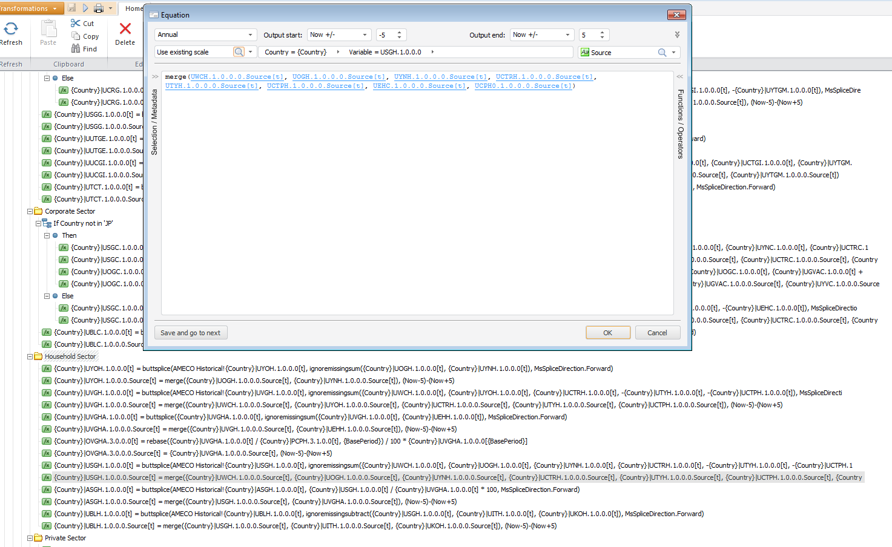

.. _tutorial1:

Tutorial 1: Adding new country calculations
=============================================

We are using TDD, and currently we are focused on implementing all the country calculations for annual data. We are using tests/test_country_calculation.py for development and testing.
Adding a new step consists on writing the new class and call it from tests/country_calculation.py with the correct set of input dataframes.
In order to add more calculations and maintain the same structure it is convenient to follow these steps:

1. Read the source algorithm and determine what input variables we need and what output variables we need to calculate.
2. Check where the input data comes from (source data from the country, source databases -ameco_h, output_gap, etc.- or data calculated in previous steps or in this one.
   Prepare the necessary input dataframes. In order to easily identify what variables we get in each step, we export .txt and .xls files with the results at the end.
3. Create the class to perform the calculations, and call it from tests/test_country_calculation.py

For this tutorial we will create a new step Household Sector. This is our source algorithm, if the formulas are too long they can be open with a double-click.

1. Determine inputs and outputs
    The lines with the word "Source" can be ignored, {Country}|UYOH.1.0.0.0.Source[t].
    In this case, it's easy to determine the input and the outputs (if there are too many you can use a script):

        Household Sector
            1- {Country}|UYOH.1.0.0.0[t] = buttsplice(AMECO Historical!{Country}|UYOH.1.0.0.0[t], ignoremissingsum({Country}|UOGH.1.0.0.0[t], {Country}|UYNH.1.0.0.0[t]), MsSpliceDirection.Forward)
            2- {Country}|UYOH.1.0.0.0.Source[t] = merge({Country}|UOGH.1.0.0.0.Source[t], {Country}|UYNH.1.0.0.0.Source[t]), (Now-5)-(Now+5)
            3- {Country}|UVGH.1.0.0.0[t] = buttsplice(AMECO Historical!{Country}|UVGH.1.0.0.0[t], ignoremissingsum({Country}|UWCH.1.0.0.0[t], {Country}|UYOH.1.0.0.0[t], {Country}|UCTRH.1.0.0.0[t], -{Country}|UTYH.1.0.0.0[t], -{Country}|UCTPH.1.0.0.0[t]), MsSpliceDirecti
            4- {Country}|UVGHA.1.0.0.0[t] = buttsplice({Country}|UVGHA.1.0.0.0[t], ignoremissingsum({Country}|UVGH.1.0.0.0[t], {Country}|UEHH.1.0.0.0[t]), MsSpliceDirection.Forward)
            5- {Country}|OVGHA.3.0.0.0[t] = rebase({Country}|UVGHA.1.0.0.0[t] / {Country}|PCPH.3.1.0.0[t], {BasePeriod}) / 100 * {Country}|UVGHA.1.0.0.0[{BasePeriod}]
            6- {Country}|USGH.1.0.0.0[t] = buttsplice(AMECO Historical!{Country}|USGH.1.0.0.0[t], ignoremissingsum({Country}|UWCH.1.0.0.0[t], {Country}|UOGH.1.0.0.0[t], {Country}|UYNH.1.0.0.0[t], {Country}|UCTRH.1.0.0.0[t], -{Country}|UTYH.1.0.0.0[t], -{Country}|UCTPH.1
            7- {Country}|ASGH.1.0.0.0[t] = buttsplice(AMECO Historical!{Country}|ASGH.1.0.0.0[t], {Country}|USGH.1.0.0.0[t] / {Country}|UVGHA.1.0.0.0[t] * 100, MsSpliceDirection.Forward)
            8- {Country}|UBLH.1.0.0.0[t] = buttsplice(AMECO Historical!{Country}|UBLH.1.0.0.0[t], ignoremissingsubtract({Country}|USGH.1.0.0.0[t], {Country}|UITH.1.0.0.0[t], {Country}|UKOH.1.0.0.0[t]), MsSpliceDirection.Forward)

    **Inputs**:
        UYOH.1.0.0.0, UOGH.1.0.0.0, UYNH.1.0.0.0, UVGH.1.0.0.0, UWCH.1.0.0.0, UCTRH.1.0.0.0, UTYH.1.0.0.0, UCTPH.1.0.0.0, UVGHA.1.0.0.0, UEHH.1.0.0.0, PCPH.3.1.0.0, USGH.1.0.0.0, ASGH.1.0.0.0, UBLH.1.0.0.0, UITH.1.0.0.0, UKOH.1.0.0.0

    **Outputs**:
        UYOH.1.0.0.0, UVGH.1.0.0.0, UVGHA.1.0.0.0, OVGHA.3.0.0.0, USGH.1.0.0.0, ASGH.1.0.0.0, UBLH.1.0.0.0

2. Check where the input data come from and prepare the necessary input dataframes.
    We need to find out where the input data comes from. Possible sources:

    - Input databases (ameco_h, ameco_db, output_gap...). If it comes from one of these, it will be specified in the formula (i.e. **AMECO Historical!**{Country}|UYOH.1.0.0.0[t]).
    - Value calculated in previous steps. (We have to search in the output/ directory, if it has been calculated previously, it should be in at least one of those files. We should take the last series in case it has been recalculated more than once).
      We can use a tool like grep or ack.
    - Value calculated previously in this same step. In this case we would get the data from self.result.
    - Input from the country forecast. If it has not been calculated in previous steps, it can be in the source data provided by the country.

    In this case we can see that some of the variables are calculated in this same step, other variables are calculated in step1 (we will get those data from CountryCalculation().result_1), and we will also need the ameco_h database

    .. code-block:: console

        $ for item in UYOH.1.0.0.0 UOGH.1.0.0.0 UYNH.1.0.0.0 UVGH.1.0.0.0 UWCH.1.0.0.0 UCTRH.1.0.0.0 UTYH.1.0.0.0 UCTPH.1.0.0.0 UVGHA.1.0.0.0 UEHH.1.0.0.0 PCPH.3.1.0.0 USGH.1.0.0.0 ASGH.1.0.0.0 UBLH.1.0.0.0 UITH.1.0.0.0 UKOH.1.0.0.0;
        do ack $item output/;
        done
        output/outputall.txt
        113:UOGH.1.0.0.0

        output/outputvars1.txt
        116:UOGH.1.0.0.0
        output/outputall.txt
        209:UYNH.1.0.0.0

        output/outputvars1.txt
        214:UYNH.1.0.0.0
        output/outputall.txt
        191:UWCH.1.0.0.0

        output/outputvars1.txt
        196:UWCH.1.0.0.0
        output/outputall.txt
        62:UCTRH.1.0.0.0

        output/outputvars1.txt
        62:UCTRH.1.0.0.0
        output/outputall.txt
        177:UTYH.1.0.0.0

        output/outputvars1.txt
        180:UTYH.1.0.0.0
        output/outputall.txt
        58:UCTPH.1.0.0.0

        output/outputvars1.txt
        58:UCTPH.1.0.0.0
        output/outputall.txt
        75:UEHH.1.0.0.0

        output/outputvars1.txt
        76:UEHH.1.0.0.0
        output/outputall.txt
        388:PCPH.3.1.0.0

        output/outputvars7.txt
        3:PCPH.3.1.0.0
        output/outputall.txt
        94:UITH.1.0.0.0

        output/outputvars1.txt
        96:UITH.1.0.0.0
        output/outputall.txt
        102:UKOH.1.0.0.0

        output/outputvars1.txt
        104:UKOH.1.0.0.0

3. Therefore, the parameters needed for this step are result_1 and ameco_h.
    In this step we observe that all lines except numbers 5 and 7 are combining butt_splice and ignoremissingsum / ignoremissingsubtract.
    Since this type of calculation appears multiple times, we have a mixin to simplify those called :ref:`fdms.utils.mixins.SumAndSpliceMixin<stepmixin>`.
    So, we will have to create the file computation/country/annual/household_sector.py with the following contents:

.. include:: ../../../computation/country/annual/fiscal_sector.py
